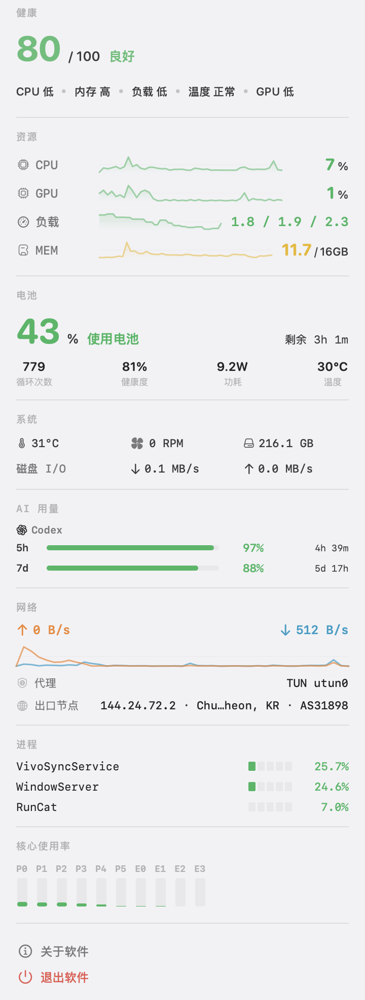
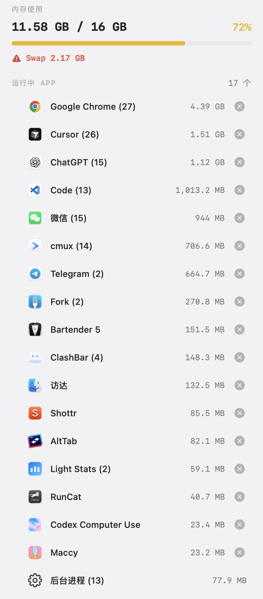
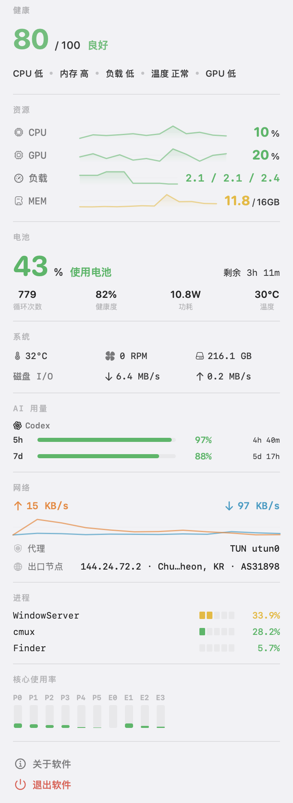
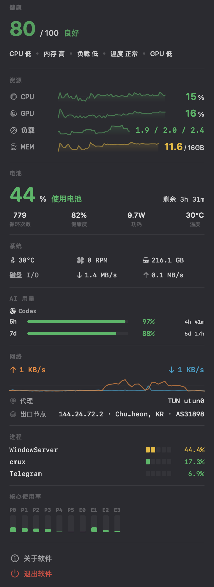

# Light Stats

Light Stats は、「いま Mac に負荷がかかっているか」を示すネイティブ macOS メニューバー型の状態計器です。0〜100 の健康度とリアルタイム信号を表示し、必要に応じて AI CLI 使用量、ネットワーク出口、Finder 操作、ウィンドウ配置、ディスプレイのスリープ防止を追加できます。ポップオーバーは 4 つの視覚テーマ(既定はデフォルト)に対応し、設定ウィンドウはシステム白のツールパネルのままです。

[English](README.md) · [简体中文](README.zh.md) · **日本語** · [한국어](README.ko.md)

---

https://github.com/user-attachments/assets/f167325d-e972-42fe-a54f-17a8a7a40834

---

## スクリーンショット

コールドスタートの「デフォルト」テーマ — 概要とメモリ:

| 概要 | メモリ |
|------|--------|
|  |  |

テーマ（概要）:

| デフォルト | Bento グリッド | サンゴールド | インクナイト |
|------------|----------------|--------------|--------------|
|  |  |  |  |

---

## 概要

Light Stats は Mac のライブな負荷シグナルをメニューバーに常時表示し、必要なときに詳細な浮動パネルを開けます。Activity Monitor を開きっぱなしにせず状態を確認したいパワーユーザーや、AI エージェント、ネットワーク、Finder の作業コンテキストも近くに置きたい開発者向けです。

通常のサンプリングには macOS ネイティブ API を使用し、サードパーティのランタイム依存はありません。モニタリングは読み取り専用のコアで、ネットワークリクエストと継続的なシステム操作は**既定でオフ**です。クリーンインストール直後はメニューバー表示だけが動作し、追加アイコン、アクセシビリティ許可要求、イベント tap、外部リクエストはありません。

---

## 機能

### メニューバー

- 固定幅の数値でレイアウトのちらつきを抑えるコンパクトな 2 行表示
- Logo・CPU・GPU・メモリ・ディスク・ネットワーク・ファン・バッテリー・健康度を任意に表示
- アップロード／ダウンロード速度表示
- ファン状態を回転アイコン風に表示
- 0〜100 の健康度スコアを任意表示

### 概要パネル

- CPU・GPU・メモリ圧迫・スワップ活動・ロードアベレージ
- P/E コア使用率グラフと CPU プロセスランキング
- 対応機種ではバッテリー状態・残量・充放電回数・健康度・消費電力・温度
- ディスク容量と集約ディスク I/O 速度
- ネットワーク速度・ローカルプロキシ状態・任意の公開出口ノード情報
- 温度・ファン・熱状態・ディスク状態のステータスバー
- システム健康度スコア、各次元の概要、次元ごとの切り替え
- AI 監視を有効にすると Claude Code・Codex・Gemini のサブスクリプション使用量
- 主要指標の短期スパークライン
- 指標アイコンはテンプレート着色可能な SVG アウトライン(CPU・GPU・メモリ・ディスク・ネットワーク・プロキシ・温度・プロセス)

### 外観

- 製品面(ポップオーバー、About、Toast、更新、権限案内)向けに 4 テーマ:
  - **デフォルト**(コールドスタート既定):システムの計器表示(カード枠なし。macOS 26+ は Liquid Glass、macOS 15 は通常のシステム表面)
  - **Bento グリッド**:従来のカードグリッド + システム素材
  - **サンゴールド**:暖かな金のグレインメッシュ
  - **インクナイト**:墨黒のグレインメッシュとチャコール表面
- サンゴールド / インクナイト は共通の外観調整:グレインのオンオフと、光の動き 5 段階(静止・穏やか・自然・滑らか・活発)
- 設定ウィンドウはシステム白のまま表示テーマに追従せず、落ち着いたツールパネルとして保つ

### メモリクリーンアップ

- メモリ圧迫状況とスワップ警告
- メモリ使用量順に並べた App 一覧
- 通常終了と確認付きの強制終了
- 子プロセスの詳細を展開表示
- レイアウトはテーマに追随(Bento はカード、それ以外は instrument 行)

### Finder メニュー

- 既定でオフの FinderSync 拡張
- パスまたはファイル名のコピー、選択したターミナルで開く、隠し属性の切り替え
- 文書、Web、データ、コードに分類された新規ファイルテンプレート
- 新規ファイルは種類ごとの開始名(例:`index`・`main`・`notes`)で、一律 Untitled ではない
- お気に入りフォルダへの移動／コピー、設定した App で開く操作
- 現在位置で cmux の新規ウィンドウまたはワークスペースを開く任意操作
- 設定画面で拡張の登録状態を確認し、Finder を再読み込み

### ウィンドウ管理

- 単一の**「ウィンドウ管理」スイッチ**（既定でオフ）で、メニューバーのウィンドウ操作アイコン・グローバルなスナップショートカット・タイトルバージェスチャーを一度にまとめて有効化します。個別のサブ切り替えはありません
- デザイナー提供のアイコン付きウィンドウ操作メニュー
- 左半分・右半分・上半分・下半分だけにショートカットを割り当て、高頻度操作を優先
- 角、三分割、ディスプレイ移動、最大化、中央配置、復元、最小化をメニューから実行
- タイトルバー上のトラックパッドジェスチャーでスナップし、プレビューと触覚フィードバックを表示
- スイッチをオフにするとアイコンを直ちに削除し、ウィンドウ操作のイベント tap をすべて停止します。アクセシビリティ権限はオンにしたときにのみ要求されます

### スクロール方向制御

- 垂直／水平スクロール方向の反転
- スクロール量を調整するステップ倍率
- 関連機能が有効なときだけイベント tap を起動

### 清掃モード

- キーボード清掃のために 60 秒間キーボード入力をロック
- 全画面の半透明オーバーレイとカウントダウン
- マウスだけで終了できるボタン。キーボード入力は抑止
- CGEventTap を使用し、アクセシビリティ権限が必要

### スリープ防止とログイン時起動

- アクセシビリティ権限なしでディスプレイのスリープを任意に防止
- オフにするか Light Stats を終了すると直ちに停止
- macOS のネイティブログイン項目サービスでログイン時起動を設定

### 更新

- 手動確認と任意の自動確認で GitHub Releases を使用。自動確認は既定でオフ
- 更新チャネル:**Stable**(正式版のみ)または **Beta**(`v1.9.0-beta.N` などの prerelease も含む)
- SemVer 2.0 でプレリリース識別子を正しく比較し、beta の増分と正式版への昇格を判別
- DMG をダウンロードし、codesign 署名・公証・Team ID を検証
- アプリ終了後に独立スクリプトで app bundle を置き換え
- ダウンロードとインストール中は軽量な進捗ウィンドウを表示

### 診断ログ

- Unified Logging とローカル JSONL への構造化診断ログ(リモート送信なし)
- 3 段階:オフ / エラーのみ / フル(既定はフル)。約 5 日保持、ローテーションとマスキングあり
- 設定からローカルログフォルダを開ける。プロセス識別子・ネットワークアドレス・出口ノード詳細はフルでは書かない

### ネットワークとプロキシ

Light Stats は環境変数・システムプロキシ設定・アクティブなトンネルインターフェースからローカルプロキシ構成を検出します。この処理で外部リクエストは発生しません。

公開出口ノードの検出は任意です。有効にすると、選択した geo-IP プロバイダに公開 IP・位置・ASN・ISP を照会し、結果をキャッシュして繰り返しの要求を避けます。

### AI サブスクリプション使用量

有効にすると、Light Stats は Claude Code・Codex・Gemini の CLI がローカルに保存した認証情報を読み取り、そのプロバイダから現在のサブスクリプション利用率を取得します。AI 監視は既定でオフで、認証情報が別のプロバイダや Light Stats 開発者に送られることはありません。

Claude Code と Codex には、別々の使用量ウィンドウ保活スイッチがあります。どちらも既定でオフです。ローリングウィンドウのリセット後、一時的な空のディレクトリから各 CLI を通じて最小プロンプト `ok` を送信し、通常出力を破棄して新しいウィンドウを確認します。Gemini にはこの機能はありません。

### 健康度スコア

健康度スコアは CPU、メモリ圧迫とスワップ、ロードアベレージ、温度、GPU、電源状態を 0〜100 のスコアに集約します。ディスク容量のような変化の遅い数値ではなく、現在の応答性に影響する圧迫シグナルを重視します。ノート Mac ではバッテリー状態、デスクトップ Mac ではディスク I/O 圧迫を電源次元として扱います。欠落または無効化された次元の重みは自動的に再配分されます。

---

## プライバシー

Light Stats にはリモートテレメトリはありません。ローカルシステム指標、ローカルプロキシ検出、プロセス一覧、スクロール動作、ウィンドウ操作は Mac 上に留まります。

- クリーンインストールは外部リクエストを行いません。出口ノード照会、AI 使用量監視、Claude/Codex の保活、自動更新確認はすべて既定でオフです。Beta 更新チャネルも既定でオフです。
- 出口ノード検出は、選択した geo-IP プロバイダに公開 IP、位置、ASN、ISP を照会し、結果を 60 秒間キャッシュします。
- AI 監視は、有効にしたプロバイダ自身の使用量エンドポイントだけに接続し、その CLI が保存済みの認証情報を使用します。
- 任意の Claude/Codex 保活は、上記の最小プロンプトを各プロバイダの CLI から送信します。
- 手動更新確認と任意の自動確認は GitHub Releases に接続し、ダウンロード後は署名、公証、Team ID を検証します。
- 診断ログ(既定フル、エラーのみ／オフに変更可)はディスク上にのみ残り、プライバシー配慮のマスキングがあり、Light Stats 開発者へは送られません。

分析、クラッシュレポート、広告、アカウントシステム、開発者運営のテレメトリエンドポイントはありません。詳細は[プライバシーポリシー](https://evilirving.github.io/light-stats/#privacy)を参照してください。

---

## インストール

[GitHub Releases](https://github.com/EvilIrving/light-stats/releases/latest) から最新の DMG をダウンロードして開き、Light Stats を「アプリケーション」にドラッグします。リリースビルドは署名・公証済みで、内蔵アップデータも置き換え前に codesign、公証、Team ID を検証します。

要件：macOS 14 以降。主な対象は Apple Silicon です。

---

## 設定

- 視覚テーマ(デフォルト / Bento / サンゴールド / インクナイト)と、サンゴールド/インクナイト のグレイン・光の動き
- メニューバー項目の表示切り替え
- 更新頻度：低 (5s)、中 (2s)、高 (1s)
- 温度単位：摂氏または華氏
- ログイン時起動、自動更新確認、Stable/Beta チャネル、ディスプレイのスリープ防止
- 診断ログレベル(オフ / エラー / フル)とログフォルダを開く操作
- 出口ノード検出とプロバイダの選択
- Claude Code・Codex・Gemini の AI 監視と、Claude/Codex 個別の保活スイッチ
- 垂直スクロール反転、水平スクロール反転、ステップ倍率
- ウィンドウ管理（メニューバーアイコン・スナップショートカット・タイトルバージェスチャーをまとめる単一スイッチ）
- Finder メニュー、ターミナル選択、cmux 操作、お気に入りフォルダ、App、ファイルテンプレート
- 健康度スコアの次元切り替え
- 言語：简体中文、English、日本語、한국어、システム言語

設定は「一般」「モニタリング」「追加ツール」に分かれ、サイドバーの状態点で有効な任意機能を確認できます。ウィンドウはシステム白の固定キャンバス。表示テーマはポップオーバーなど製品面のみに適用されます。

---

## 開発

詳しくは [CONTRIBUTING.md](CONTRIBUTING.md) を参照してください。

### 動作要件

- macOS 14+
- Xcode 16 以降を推奨
- Swift 5.9+
- ローカル lint には SwiftLint (`brew install swiftlint`)

### ビルド

```bash
# 最新の Debug app をビルドして起動
./debug-run.sh

# 手動 Debug ビルド
xcodebuild -project "Light Stats.xcodeproj" \
  -scheme "Light Stats" \
  -configuration Debug \
  -derivedDataPath build/DerivedData build

# Release DMG
./build.sh
```

### 品質チェック

```bash
swiftlint lint --strict
./validate_localization.sh
```

GitHub Actions は SwiftLint、ローカライズ検証、Release ビルド、成果物アップロード、タグでの署名／公証、GitHub Release 作成を実行します。

### テスト

XCTest スイートは `LightStatsTests/` にあり、Xcode プロジェクトに組み込まれています（共有
`Light Stats` スキーム上の `LightStatsTests` ユニットテストターゲット）。CI と以下のコマンドの
両方で実行されます。カバレッジはリグレッションしやすい純粋ロジックに集中しています：
`HealthScoreService` のスコア曲線、「デフォルトオフ」設定の契約、そして 3 つの AI 使用量 JSON
パーサー（フィクスチャは `LightStatsTests/Fixtures/`）。

```bash
xcodebuild test \
  -project "Light Stats.xcodeproj" \
  -scheme "Light Stats" \
  -destination 'platform=macOS'
```

### 技術スタック

- パネルと設定に SwiftUI
- メニューバー統合、ポップオーバー、オーバーレイ、カスタムビューに AppKit
- Combine と Swift Concurrency
- Mach API、IOKit、Accessibility、Core Graphics event tap、CFNetwork、Network、SMC、getifaddrs
- サードパーティのランタイム依存なし

### アーキテクチャ

アプリはモデル・サービス・ビューモデル・ビューの層に分かれています。`SystemMonitor` がサンプリングを統括して UI にスナップショットを発行し、各サービスが対応する指標を収集します。

キャッシュや非同期が必要な収集器（出口ノード照会や AI 使用量プロバイダなど）は actor を使用します。UI に紐づく状態は main actor に留めます。高速な syscall ヘルパーは適切な場面で同期のまま保ちます。

### プロジェクト構成

- `Light Stats/Models/`: 指標データ構造、健康度、リリース情報、`AppTheme`
- `Light Stats/Services/`: システム収集、スコアリング、更新、スクロール反転、ウィンドウスナップ、ホットキー、タイトルバージェスチャー、キーボードロック、AI 使用量、診断ログ
- `Light Stats/ViewModels/`: アプリ状態、サンプリング、設定、清掃モード、更新統括
- `Light Stats/Views/StatusBar/`: メニューバー描画
- `Light Stats/Views/Popover/`: 浮動パネル UI と再利用コンポーネント
- `Light Stats/Views/Theme/`: テーマトークン、メッシュ背景、グレイン、ピッカー、外観プリセット
- `Light Stats/Views/Settings/`: 設定 UI(システム白のツールパネル)
- `Light Stats/Views/About/`: About ウィンドウ
- `Light Stats/Views/CleaningMode/`: 清掃モードオーバーレイ
- `Light Stats/Views/Update/`: 更新進捗ウィンドウ
- `Light Stats/Views/Permission/`: テーマ付きアクセシビリティ案内
- `Light Stats/Utilities/`: フォーマッタ、メトリック履歴、`SVGIcon`
- `Light Stats/Resources/`: ローカライズ文字列、ウィンドウ操作アイコン、指標 SVG
- `FinderMenu/` と `FinderMenuExtension/`: 共通 Finder 操作と FinderSync 統合
- `LightStatsTests/`: XCTest(健康度、既定値、AI パーサ、PTY、診断、SemVer、Finder テンプレート)
- `.github/workflows/`: ビルド、デプロイ、リリース自動化

---

## ロードマップ

- より詳細なネットワーク診断
- Intel・Apple Silicon・ノート・デスクトップ Mac でのさらなる検証
- App ごとのネットワーク使用量
- より細かなクリーンアップ提案
- テーマ、ウィンドウジェスチャー、メニューバー密度の継続的な調整
