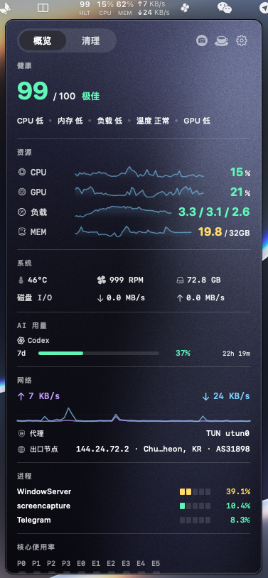
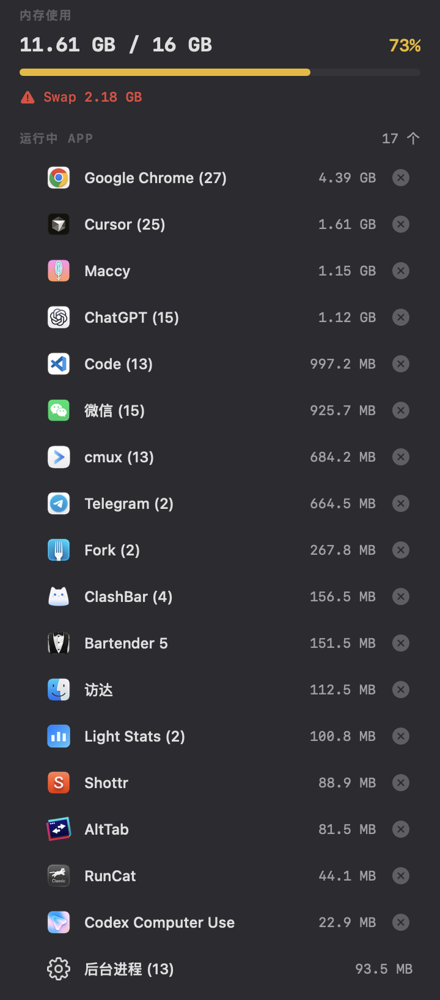
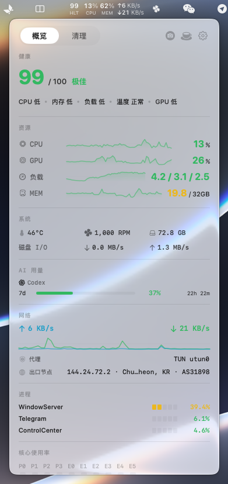
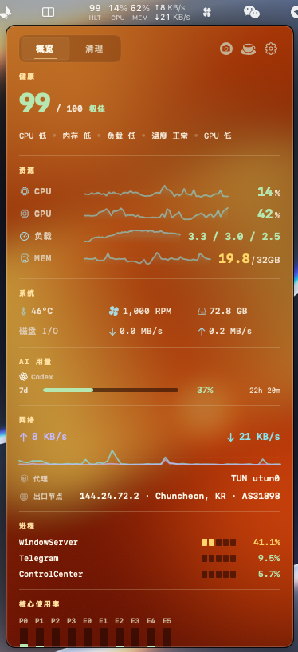
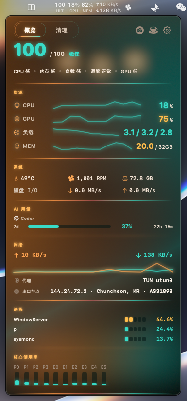

# Light Stats

[](https://github.com/EvilIrving/light-stats/actions/workflows/build.yml)
[](https://github.com/EvilIrving/light-stats/actions/workflows/release.yml)

Light Stats is a native macOS menu bar instrument that shows whether your Mac is **under pressure right now**, not just how full it is. A 0-100 health score and live CPU, GPU, and memory-pressure signals sit in the menu bar; optional developer tools add AI CLI usage, proxy and exit-node context, Finder actions, window placement, and display keep-awake. The popover can wear one of four visual themes, with Ink Night selected on a clean install, while Settings stays a plain system-white tool panel.

**English** · [简体中文](README.zh.md) · [日本語](README.ja.md) · [한국어](README.ko.md)

---

https://github.com/user-attachments/assets/f167325d-e972-42fe-a54f-17a8a7a40834

---

## Screenshots

Ink Night, the clean-install default, shown in Overview and Memory:

| Overview | Memory |
|----------|--------|
|  |  |

Themes (Overview):

| Classic | Golden Hour | Amber | Ink Night |
|---------|------|-----------|-----------|
|  |  |  |  |

---

## Overview

Light Stats keeps the Mac's live pressure signals visible in the menu bar and opens a detailed floating panel when you need more context. It is designed for power users and developers who want quick status checks without keeping Activity Monitor open, plus optional workflow context for AI coding agents, networks, and Finder.

The app uses native macOS APIs for routine sampling and has no third-party runtime dependencies. Monitoring is the read-only core; network requests and persistent system interactions are **off by default**. On a clean install you get only the menu bar readout: no extra icon, no Accessibility prompt, no event tap, no privileged helper, and no outbound request.

---

## Features

### Menu Bar

- Compact two-line status item with fixed-width values to avoid layout jumping
- Optional items for Logo, CPU, GPU, memory, disk, network, fan, battery, and health
- Upload and download speed display
- Fan indicator with a rotating visual style
- Optional 0-100 health score display

### Overview Panel

- CPU, GPU, memory pressure, swap activity, and load average
- P/E core usage charts and top CPU processes
- Battery status, charge level, cycle count, health, power draw, and temperature when available
- Disk capacity and aggregate disk I/O speed
- Network speed, local proxy state, and optional public exit-node information
- Temperature, fan, thermal state, and disk status strip
- System health score with dimension-level summary and toggles
- Claude Code, Codex, and Gemini subscription usage when AI monitoring is enabled
- Short-term sparklines for key metrics
- Metric icons use template-tinted SVG outlines (CPU, GPU, memory, disk, network, proxy, temperature, processes)

### Appearance

- Four visual themes for the product surfaces (popover, About, Toast, Update, permission prompts):
  - **Classic**: system instrument readout without card chrome (Liquid Glass on macOS 26+, ordinary system chrome on macOS 15)
  - **Golden Hour**: warm grain and brass instrument ink over an amber and coral light field
  - **Amber**: espresso-black cocktail bar with warm amber light and a cool teal neon accent
  - **Ink Night** (clean-install default): ink-black grain with cool charcoal surfaces
- Golden Hour, Amber, and Ink Night each provide film-grain and five-step light-dynamics controls (Still, Gentle, Natural, Smooth, Lively)
- The Settings window stays system white and does not follow the display theme, so configuration remains a calm tool panel

### Memory Cleanup

- Memory pressure overview and swap warning
- App list sorted by memory usage
- Normal quit and force quit with confirmation
- Expandable child process details
- Layout is the instrument readout: sections, hairlines, and dense rows

### Finder Menu

- Optional FinderSync extension, disabled by default
- Copy path or file name, open a chosen terminal, and toggle hidden state
- Create files from curated templates grouped by document, web, data, and code types
- Type-aware starting names for new files (for example `index`, `main`, `notes`) instead of a single Untitled label
- Move or copy selections to favorite directories and open them with configured apps
- Optional cmux actions for a new window or workspace at the current Finder location
- Extension registration status and Finder refresh controls in Settings

### Window Management

- A single **Window Management** switch (off by default) turns everything on together: the menu bar window-control icon, the global snap shortcuts, and the titlebar gestures — there are no separate sub-toggles
- Menu bar window-control menu with designer-provided action icons
- Left, right, top, and bottom half shortcuts for high-frequency window placement
- `Control + Option + Return` maximizes the current window; `Control + Option + C` centers it
- Additional menu actions for corners, thirds, display movement, maximize, center, restore, and minimize
- Titlebar trackpad gestures for quick snapping with preview overlay and haptic feedback
- Turning the switch off removes the icon and stops all window-control event taps immediately; Accessibility permission is requested only when you turn it on

### Scroll Direction Control

- Independent vertical and horizontal scroll-direction reversal
- Traditional mouse wheels are affected by default; trackpads and Magic Mouse can be included explicitly
- Optional mouse-wheel acceleration disablement with a fixed 1 to 10 lines per wheel step
- Step multiplier for fine-tuning reversed wheel movement
- Uses an Accessibility event tap only when reversal or acceleration control is enabled, and rebuilds the tap after wake when needed

### Find My Mouse

- Double-tap a left modifier key (Control, Option, Command, or Shift — picker in Settings) to dim every display and spotlight the pointer
- The spotlight follows the pointer; any click or key press fades it out, with a 4-second safety timeout
- Listen-only event tap that never intercepts or rewrites events; requires Accessibility permission and is off by default
- Pro features: anyone who launches the app during the current gift period keeps Pro for life. After the first paid release, new users unlock Pro with an activation code (Settings → General). The app stays MIT-licensed; codes are verified offline with Ed25519 and make no network call

### Cleaning Mode

- 60-second keyboard lock for safe keyboard cleaning
- Full-screen translucent overlay with countdown timer
- Mouse-only exit button, while keyboard input is suppressed
- Uses CGEventTap with Accessibility permission

### Keep Awake and Launch at Login

- Popover-toolbar quick toggle for display-sleep prevention, with no Accessibility permission
- Stops immediately when toggled off or when Light Stats exits
- Optional launch at login through the native macOS login-item service

### Auto-Update

- Manual checks and optional automatic checks use GitHub Releases; automatic checks are off by default
- Update channel: **Stable** (final releases only) or **Beta** (also considers prerelease builds such as `v1.9.0-beta.N`)
- SemVer 2.0 comparison understands pre-release identifiers so beta increments and promotion to a final release are ordered correctly
- Downloads and verifies DMG with codesign, notarization, and Team ID checks
- Replaces the running app via a detached script after exit
- Shows a minimal progress window during download and install

### Diagnostic Logging

- Local structured diagnostic log written alongside Unified Logging (no remote upload)
- Three levels: Off, Errors only, or Full (default Full); retained for a limited window (about five days) with rotation and redaction
- Settings can open the local log directory; process identity, network addresses, and exit-node details are not written in full form

### Network and Proxy

Light Stats detects local proxy configuration from environment variables, system proxy settings, and active tunnel interfaces without sending external requests.

Public exit-node detection is optional. When enabled, it can query a selected geo-IP provider for public IP, location, ASN, and ISP, then cache the result to avoid repeated requests.

### AI Subscription Usage

When enabled, Light Stats reads credentials stored locally by Claude Code, Codex, and Gemini CLIs, then requests current subscription utilization from that provider. AI monitoring is disabled by default and never transmits credentials to another provider or to the Light Stats developer.

Claude Code and Codex each have a separate, off-by-default usage-window warmup switch. After a rolling window resets, warmup sends the minimal headless prompt `ok` through that provider's CLI from a temporary empty directory, discards normal output, and verifies the new window. Gemini does not use warmup.

### Health Score

The health score summarizes CPU, memory pressure and swap, load average, temperature, GPU, and power into a 0-100 score. It focuses on real-time responsiveness pressure rather than slow-moving capacity numbers. On laptops, the power dimension uses battery state; on desktops, it uses disk I/O pressure. Missing or disabled dimensions are reweighted automatically.

---

## Privacy

Light Stats has no remote telemetry. Local system metrics, local proxy detection, process lists, scroll behavior, and window control stay on the Mac.

- A clean install makes no outbound request. Exit-node lookup, AI usage monitoring, Claude/Codex warmup, and automatic update checks are all disabled by default. The Beta update channel is also off by default.
- Exit-node detection contacts the selected geo-IP provider to identify the public IP, location, ASN, and ISP, then caches the result for 60 seconds.
- AI monitoring contacts only the enabled provider's own usage endpoint using credentials already stored by that provider's CLI.
- Optional Claude/Codex warmup sends the headless prompt described above through the selected provider's CLI.
- Manual update checks and opt-in automatic checks contact GitHub Releases; downloaded updates are verified before installation.
- Diagnostic logging (default Full, switchable to Errors or Off) stays on disk under the app's support directory. It is privacy-aware and never sent to the Light Stats developer.

There is no analytics, crash reporting, advertising, account system, or developer-operated telemetry endpoint. See the full [privacy policy](https://evilirving.github.io/light-stats/#privacy).

---

## Install

Download the latest DMG from [GitHub Releases](https://github.com/EvilIrving/light-stats/releases/latest), open it, and drag Light Stats into Applications. Release builds are signed and notarized; the built-in updater also verifies codesign, notarization, and Team ID before replacing the app.

Requirements: macOS 14 or later. Apple Silicon is the primary target.

---

## Settings

- Visual theme (Classic, Golden Hour, Amber, Ink Night), with film grain and light dynamics for the three dynamic themes
- Menu bar item visibility
- Refresh rate: Low (5s), Medium (2s), High (1s)
- Temperature unit: Celsius or Fahrenheit
- Launch at login, automatic update checks, and Stable/Beta update channel; Keep Awake is a popover-toolbar quick toggle
- Diagnostic log level (Off / Errors / Full) and open-log-folder control
- Exit-node detection and provider selection
- AI monitoring for Claude Code, Codex, and Gemini, plus separate Claude/Codex warmup switches
- Vertical and horizontal reversal, optional trackpad and Magic Mouse inclusion, wheel-acceleration control, fixed line count, and step multiplier
- Window management (a single toggle for the menu bar icon, snap shortcuts, and titlebar gestures)
- Finder menu, terminal selection, cmux actions, favorite directories, apps, and file templates
- Health score dimension toggles
- Language: English, Simplified Chinese, Japanese, Korean, or system language

The Settings sidebar links directly to **General**, **Monitoring**, **Input Devices**, **Window Management**, **AI Usage**, and **Right-Click Menu**. It is navigation-only and does not show runtime status dots. The window uses a fixed system-white canvas with a light sidebar; only the monitoring popover and related product surfaces follow the selected theme.

---

## Development

See [CONTRIBUTING.md](CONTRIBUTING.md) for the full development guide.

### Requirements

- macOS 14+
- Xcode 16 or newer recommended
- Swift 5.9+
- SwiftLint for local linting (`brew install swiftlint`)

### Build

```bash
# Debug build and launch the fresh app bundle
./script/debug-run.sh

# Manual Debug build
xcodebuild -project "Light Stats.xcodeproj" \
  -scheme "Light Stats" \
  -configuration Debug \
  -derivedDataPath build/DerivedData build

# Release DMG
./script/build.sh
```

### Quality Checks

```bash
swiftlint lint --strict
./script/validate_localization.sh
```

GitHub Actions runs SwiftLint, localization validation, and XCTest as parallel quality gates. Pull requests and `main` package an unsigned DMG only after those checks pass. Release tags rerun the same gates before signing and notarization; only the verified notarized artifact can be published. GitHub Pages remains an independent docs-only workflow.

### Tests

The XCTest suite lives in `LightStatsTests/` and is wired into the Xcode project (the
`LightStatsTests` unit-test target on the shared `Light Stats` scheme), so CI and the command
below run it. Coverage focuses on the pure, regression-prone logic: the `HealthScoreService`
scoring curves, the default-off settings contract, and the three AI-usage JSON parsers (via
fixtures under `LightStatsTests/Fixtures/`).

```bash
xcodebuild test \
  -project "Light Stats.xcodeproj" \
  -scheme "Light Stats" \
  -destination 'platform=macOS'
```

### Tech Stack

- SwiftUI for panels and settings
- AppKit for menu bar integration, popovers, overlays, and custom views
- Combine and Swift Concurrency
- Mach API, IOKit, Accessibility, Core Graphics event taps, CFNetwork, Network, SMC, and getifaddrs
- Zero third-party runtime dependencies

### Architecture

The app separates metrics into models, services, view models, and views. `SystemMonitor` coordinates sampling and publishes snapshots to the UI, while services collect data for each metric area.

Cached or asynchronous collectors, such as exit-node lookup and AI usage providers, use actors. UI-bound state stays on the main actor. Fast syscall helpers remain synchronous where appropriate.

### Project Layout

- `Light Stats/Models/`: metric data structures, health score, release info, `AppTheme`
- `Light Stats/Services/`: system collectors, scoring, update, scroll reversal, window snapping, hotkeys, titlebar gestures, keyboard lock, AI usage, diagnostic logging
- `Light Stats/ViewModels/`: app state, sampling, settings, cleaning mode, update coordination
- `Light Stats/Views/StatusBar/`: menu bar rendering
- `Light Stats/Views/Popover/`: floating panel UI and reusable components
- `Light Stats/Views/Theme/`: theme tokens, mesh backgrounds, grain, picker, appearance presets
- `Light Stats/Views/Settings/`: settings UI (system-white tool panel)
- `Light Stats/Views/About/`: about window
- `Light Stats/Views/CleaningMode/`: cleaning mode overlay
- `Light Stats/Views/Update/`: update progress window
- `Light Stats/Views/Permission/`: themed Accessibility guidance panel
- `Light Stats/Utilities/`: formatters, metric history, `SVGIcon`
- `Light Stats/Resources/`: localized strings, window-control icons, metric SVG outlines
- `FinderMenu/` and `FinderMenuExtension/`: shared Finder actions and FinderSync integration
- `LightStatsTests/`: XCTest suites (health score, defaults, AI parsers, PTY, diagnostics, SemVer, Finder templates)
- `.github/workflows/`: reusable quality gates plus build, Pages deploy, and signed release automation

---

## Roadmap

- More detailed network diagnostics
- Additional validation across Intel, Apple Silicon, laptop, and desktop Macs
- Per-app network usage tracking
- More granular cleanup recommendations
- Continued tuning for themes, window gestures, and menu bar density
