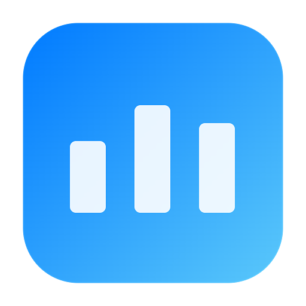
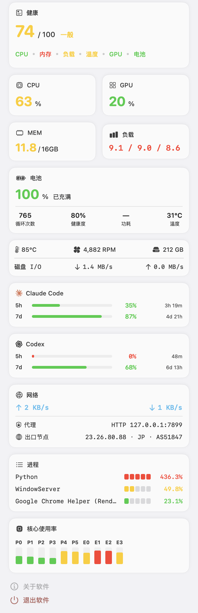
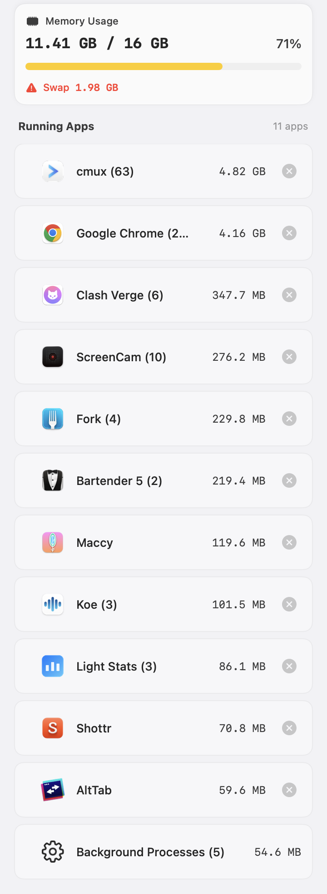

<div align="center">



# Light Stats

**原生 macOS 菜单栏状态仪表,看的是「你的 Mac 此刻卡不卡」,并把开发工作流上下文放在手边。**

0-100 健康分常驻菜单栏,一眼看压力;点开弹窗查看 CPU、GPU、内存压力、磁盘与 I/O、网络、电池、温度、风扇、进程和 AI CLI 用量,还可按需启用 Finder、窗口与保持唤醒工具。

[](https://github.com/EvilIrving/light-stats/actions/workflows/build.yml)
[](https://github.com/EvilIrving/light-stats/actions/workflows/release.yml)
[](LICENSE)

[English](README.md) · **简体中文** · [日本語](README.ja.md) · [한국어](README.ko.md)

</div>

---

https://github.com/user-attachments/assets/f167325d-e972-42fe-a54f-17a8a7a40834

---

## 为什么做 Light Stats

活动监视器告诉你「内存用了 30 GB / 32 GB」,但答不上你真正关心的那个问题:**现在这台 Mac 是不是已经吃力了?**

容量和压力是两回事。Apple Silicon 会压缩不活跃内存页,「30 GB / 32 GB」在压力正常、几乎不交换时其实很健康;反过来,一台 50% CPU 占用的 Mac 如果正在疯狂 swap,体感会很卡。看占用百分比,看不出这层区别。

Light Stats 把**实时压力信号**固定在菜单栏:一个 0-100 的健康分,加上 CPU、GPU、内存压力等关键信号。需要上下文时再点开弹窗。它是一个轻量的状态仪表,不是活动监视器的替代品。

## 它有什么不一样

- **给的是压力分,不是占用率。** 0-100 健康分综合了 CPU、内存压力与交换、负载、温度、GPU,还有电源或磁盘 I/O。内存压力正常时分数接近满分,一旦开始 swap 抖动就明显往下掉。磁盘占用百分比没有计入,那是慢慢变化的容量提醒,跟当下卡不卡没关系。
- **代理和出口节点看得见。** 不发任何外部请求,就能从环境变量、系统代理设置和活跃隧道接口判断你现在走没走代理。想知道公网出口,可以开出口节点查询,拿到公网 IP、位置、ASN 和 ISP。
- **AI CLI 用量也在里面。** 常用 Claude Code、Codex 或 Gemini 的话,开启后概览面板会显示订阅用量,凭据只用来查各家自己的接口。
- **原生写的,没有第三方依赖。** SwiftUI 加 AppKit,直接调 Mach、IOKit、SMC、Network,没有任何运行时依赖。
- **开发工作流上下文集中在一处。** AI 用量、代理和出口节点与系统压力并列显示;可选 Finder 菜单支持终端、文件模板、复制、移动和打开方式等高频操作。
- **默认零外联。** 没有遥测;出口节点探测、AI 用量、Claude/Codex 用量窗口保活和自动更新检查默认都关闭。
- **监控是核心,附加工具按需启用。** Finder 菜单、清洁模式、窗口管理、滚动方向反转和保持唤醒都默认关闭。只用监控时,菜单栏只有读数:不多一个图标、不弹辅助功能授权、不创建 event tap、不发任何网络请求。

---

## 架构

```
┌──────────────────────────────────────────────────┐
│                   菜单栏状态项                       │  常驻 · 紧凑 · 一眼看压力
│      CPU 12%   MEM ▮▮   NET ↑↓   健康分 94         │
└────────────────────────┬─────────────────────────┘
                         │ 点击展开
                         ▼
┌──────────────────────────────────────────────────┐
│                     弹窗面板                         │  需要时看全貌
│   概览  ·  清理                                     │
│   CPU / GPU / 内存压力 / 交换 / 负载                │
│   电池 / 温度 / 风扇 / 热状态                       │
│   磁盘 / I/O · 网络 / 代理 / 出口节点 · AI 用量     │
└────────────────────────┬─────────────────────────┘
                         │ 定时采样
                         ▼
   原生 macOS API:Mach · IOKit · SMC · Network · getifaddrs
   零第三方运行时依赖 · 默认零遥测 · LSUIElement 菜单栏 agent
```

---

## 界面预览

| 概览 | 清理 |
|------|------|
|  |  |

---

## 功能

### 菜单栏

- 紧凑的双行状态项,数值固定宽度,避免布局跳动
- 可选显示 Logo、CPU、GPU、内存、磁盘、网络、风扇、电池、健康分
- 网络上传和下载速率显示
- 风扇使用旋转图标表达状态
- 可选显示 0-100 健康分

### 概览面板

- CPU、GPU、内存压力、交换活动和负载均值
- P/E 核心使用率图表和 CPU 进程排行
- 电池状态、电量、循环次数、健康度、功耗和温度,按机型能力显示
- 磁盘容量和聚合磁盘 I/O 速率
- 网络速率、本地代理状态和可选公网出口节点信息
- 温度、风扇、热状态和磁盘状态条
- 系统健康分、各维度摘要和维度开关
- 开启 AI 监控后显示 Claude Code、Codex、Gemini 订阅用量
- 关键指标短期趋势折线

### 内存清理

- 内存压力概览和交换空间预警
- 按内存占用排序的 App 列表
- 正常关闭和二次确认后的强制退出
- 可展开查看子进程

### Finder 右键菜单

- 可选 FinderSync 扩展,默认关闭
- 复制路径或文件名、在所选终端中打开、切换隐藏状态
- 按文档、网页、数据和代码分类的新建文件模板
- 将所选项目移动或复制到常用目录,或使用配置的 App 打开
- 可选 cmux 新窗口和新工作区操作
- 设置页显示扩展注册状态,并提供 Finder 刷新入口

### 窗口管理

- 一个**「窗口管理」总开关**(默认关闭)同时启用三样:菜单栏窗口控制图标、全局贴靠快捷键、标题栏手势——没有单独的子开关
- 菜单栏窗口控制入口,菜单动作带设计师绘制的图标
- 左半屏、右半屏、上半屏、下半屏保留快捷键,覆盖最高频窗口放置操作
- 菜单提供角落、三分之一、跨显示器移动、最大化、居中、还原、最小化等动作
- 支持标题栏触控板手势,带目标区域预览和触觉反馈
- 关闭总开关会立即移除图标并停止所有窗口控制 event tap;辅助功能权限只在你打开开关时才请求

### 滚动方向控制

- 可选垂直和水平滚动方向反转
- 步长倍率用于微调滚动手感
- 仅在相关功能开启时启动事件 tap

### 清洁模式

- 锁定键盘 60 秒,方便擦拭键盘
- 全屏半透明遮罩和倒计时
- 鼠标点击按钮可退出,键盘输入会被抑制
- 使用 CGEventTap,需要辅助功能权限

### 保持唤醒与登录启动

- 可选阻止显示器进入睡眠,无需辅助功能权限
- 关闭开关或退出 Light Stats 时立即停止
- 可通过 macOS 原生登录项服务设置登录时启动

### 更新

- 手动检查或选择开启自动检查,自动检查默认关闭
- 下载 DMG 后验证 codesign 签名、公证状态和 Team ID
- 应用退出后通过独立脚本替换运行中的 app bundle
- 下载和安装期间显示轻量进度窗口

### AI 用量窗口保活

- Claude Code 与 Codex 各有独立开关,默认关闭;Gemini 不使用此功能
- 滚动窗口重置后,通过对应 CLI 在临时空目录发送最小提示词 `ok`
- 丢弃正常输出,用量窗口验证完成后继续等待下一次重置

---

## 健康分怎么算

健康分是一个纯函数:输入原始传感器读数,输出每个维度的子分和一个平滑后的 0-100 总分。它衡量**压力,而不是容量**。

| 维度 | 权重 | 信号 |
|------|-----:|------|
| CPU | 25 | 使用率 % |
| 内存 | 30 | 内存压力等级与 swap 占 RAM 比例取较低者 |
| 负载 | 15 | 1 分钟负载均值 ÷ 核心数 |
| 温度 | 20 | SMC 温度与系统热状态取较低者 |
| GPU | 15 | 利用率 % |
| 电源 | 10 | 笔记本看电池,台式机看磁盘 I/O |

权重是相对的:传感器缺失或被关闭的维度会自动退出,剩下的重新归一化。单个性能维度饱和会触发「瓶颈封顶」,即便其他维度都正常,总分也会被压低,因为一个卡点就足以让人感到延迟。最后用 EMA 平滑,避免数字抖动。

评级:90-100 优秀 · 75-89 良好 · 60-74 一般 · 40-59 较差 · <40 危急。

---

## 隐私

Light Stats 没有远程遥测。本地系统指标、本地代理检测、进程列表、滚动行为和窗口控制都留在本机。

- **干净安装零外联。** 出口节点探测、AI 用量、Claude/Codex 用量窗口保活和自动更新检查默认全部关闭。
- **出口节点探测。** 开启后向所选 geo-IP provider 查询当前公网 IP、位置、ASN 和 ISP,结果缓存 60 秒。
- **AI 用量监控。** 开启后只请求对应 provider 自己的用量接口,使用该 provider CLI 已保存在本机的凭据,不会发送给其他 provider 或 Light Stats 开发者。
- **用量窗口保活。** 单独开启后,会在 Claude Code 或 Codex 滚动窗口重置后通过对应 CLI 发送最小提示词 `ok`;Gemini 不参与。
- **更新检查。** 手动检查或选择开启的自动检查会访问 GitHub Releases,下载后仍需通过签名、公证和 Team ID 校验。

应用没有分析、崩溃上报、广告、账户系统或由开发者运营的遥测接口。完整说明见[官网隐私页](https://evilirving.github.io/light-stats/#privacy)。

---

## Light Stats 不做什么

把边界说清楚,你才知道它适不适合你:

- **不是活动监视器替代品。** 只显示 Top-N 进程,是状态指示器,不是完整诊断工具。
- **不做按进程的网络拆分。** 只按网络接口聚合统计。
- **没有自定义图表渲染。** 使用 SwiftUI shapes 和 AppKit 视图,不碰 Core Graphics / Metal。
- **没有插件系统。** 每个指标都是内置 Service。
- **没有后台守护进程。** 普通菜单栏 app,无 XPC、无 LaunchAgent。
- **不支持 macOS 14 以前的系统,主要面向 Apple Silicon。**

---

## 安装

### 下载(推荐)

从 [GitHub Releases](https://github.com/EvilIrving/light-stats/releases/latest) 下载最新 DMG,拖入「应用程序」即可。安装包经过签名与公证;内置自动更新会在校验 codesign、公证状态和 Team ID 之后才替换自身。

要求:macOS 14 或更新版本,主要面向 Apple Silicon。

### 从源码构建

```bash
# 构建并启动最新 Debug app
./debug-run.sh

# 手动 Debug 构建
xcodebuild -project "Light Stats.xcodeproj" \
  -scheme "Light Stats" \
  -configuration Debug \
  -derivedDataPath build/DerivedData build

# Release DMG
./build.sh
```

---

## 设置

- 菜单栏项目显示开关
- 刷新频率:低 (5s)、中 (2s)、高 (1s)
- 温度单位:摄氏度或华氏度
- 登录时启动、自动检查更新和保持唤醒
- 出口节点探测和 provider 选择
- Claude Code、Codex、Gemini AI 监控,以及 Claude/Codex 独立的用量窗口保活开关
- 垂直滚动反转、水平滚动反转和步长倍率
- 窗口管理(单一开关:菜单栏图标、贴靠快捷键、标题栏手势)
- Finder 菜单、终端选择、cmux 操作、常用目录、App 和文件模板
- 健康分维度开关
- 语言:简体中文、English、日本語、한국어、跟随系统

设置页分为「通用」「监控」与「附加工具」三组,侧栏状态点会标出当前已启用的可选能力。

---

## 开发

详见 [CONTRIBUTING.md](CONTRIBUTING.md)。

### 环境要求

- macOS 14+
- 推荐 Xcode 16 或更新版本
- Swift 5.9+
- 本地 lint 需要 SwiftLint (`brew install swiftlint`)

### 质量检查

```bash
swiftlint lint --strict
./validate_localization.sh
```

GitHub Actions 会运行 SwiftLint、本地化覆盖检查、Release 构建、产物上传、tag 签名/公证和 GitHub Release 创建。

### 测试

XCTest 套件位于 `LightStatsTests/`,已接入 Xcode 工程(共享 `Light Stats` scheme 下的
`LightStatsTests` 单元测试 target),CI 与下面的命令都会运行它。覆盖重点放在易回归的纯逻辑:
`HealthScoreService` 评分曲线、"默认关闭"设置契约,以及三家 AI 用量 JSON 解析器
(fixture 位于 `LightStatsTests/Fixtures/`)。

```bash
xcodebuild test \
  -project "Light Stats.xcodeproj" \
  -scheme "Light Stats" \
  -destination 'platform=macOS'
```

### 技术栈

- SwiftUI 用于面板和设置
- AppKit 用于菜单栏集成、弹出面板、遮罩和自定义视图
- Combine 与 Swift Concurrency
- Mach API、IOKit、Accessibility、Core Graphics event tap、CFNetwork、Network、SMC、getifaddrs
- 零第三方运行时依赖

### 分层

应用按模型、服务、视图模型和视图分层,依赖方向单一:`视图 → 视图模型 → 服务 → 模型`。`SystemMonitor` 编排采样并向 UI 发布快照,各服务分别采集对应指标。需要缓存或异步执行的采集器(如出口节点查询、AI 用量 provider)使用 actor;UI 绑定状态留在主 actor;快速 syscall helper 在合适场景保持同步。

---

## 路线图

- 更详细的网络诊断
- 覆盖 Intel、Apple Silicon、笔记本和台式 Mac 的更多验证
- 按 App 统计网络用量
- 更细的清理建议
- 持续调优窗口手势和菜单栏密度

---

## 参与与许可

Light Stats 在 MIT 许可下开源。如果它对你有用,给仓库点个 star 能帮更多人找到它;遇到 bug 或者有功能想法,欢迎提 Issue;想动手改的话,提 PR 之前先读一下 [CONTRIBUTING.md](CONTRIBUTING.md)。

许可证:[MIT](LICENSE)。
