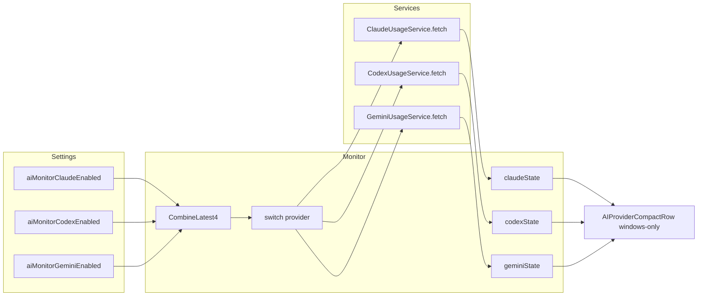
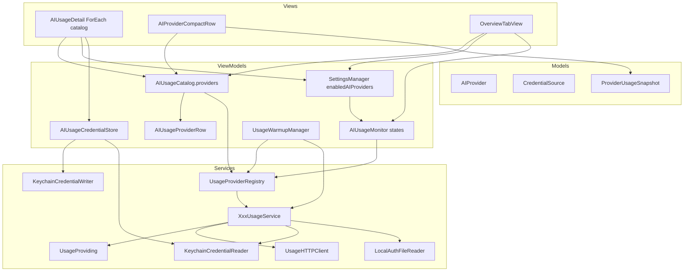

# AI 用量模块重构：编译期 Provider 登记表

| 字段 | 值 |
|---|---|
| 状态 | Implemented（2026-09-14；正文为设计时的论证记录，现状以本节「As-built」为准） |
| 作者 | Light Stats |
| 日期 | 2026-09-13 |
| 仓库 | `/Users/cain/Documents/code/swift-light-stats` |
| 取代 | `docs/ai-usage-providers.md` 中「架构缺口」与 Cursor=cookie 的过时判断；该文档的选型原则、A/B 档研究与排除名单仍有效 |
| 代码入口 | `Models/AIProvider.swift`、`Models/UsageWindow.swift`、`Models/AIUsageWindowPicker.swift`、`ViewModels/AIUsageMonitor.swift`、`ViewModels/AIUsageCatalog.swift`、`Services/AIUsage/UsageProviderRegistry.swift`、`Services/{15 家}UsageService.swift`、`Views/Popover/Components/AIUsageCard.swift`、`Views/Popover/OverviewTabView.swift` |

## Overview

Light Stats 的 AI 用量模块今天只能报三家（Claude Code / Codex / Gemini），而且三家的开关、状态、HTTP、设置行、卡片全部写死在 Monitor / Settings / View 里。产品要把覆盖面扩到「十几家最常用订阅」——告诉用户「我还剩多少」和「什么时候重置」——但加一家不能再改 `CombineLatest4`、加一个 `@Published`、改三处 `switch`、手写一行设置。

本设计采用 **C′：Services 里编译期 `UsageProviderRegistry` + `UsageProviding`，Views 只消费 ViewModel 目录 `AIUsageCatalog`**。加一家是一份机械清单：enum case、登记表一行、一个 Service、四语言文案、parser fixture。Settings 按 `settings.aiMonitor.<id>.enabled` 编址；token 经 `/usr/bin/security -i` 写入 Keychain（secret 在 stdin，绝不进 `Process.arguments`）；模型同时承载窗口（`UsageWindow`）和余额（`UsageBalance`）；卡片按快照内容分支，**禁止把余额画成 100% 进度条**。不做运行时插件、不读浏览器 cookie、不申请辅助功能 / Full Disk Access。默认全关，冷启动零请求。

PR1 只把现有三家迁到协议上，**用户可见行为与现网无法区分**（关开关不清 state、in-flight 结果照常落地）。Writer、HTTP 客户端、余额卡片随第一家消费者（DeepSeek）落地，不在架构 PR 里空转。

## Key Decisions

1. **编译期登记表，不是插件引擎。** AGENTS.md「No plugin system」禁的是运行时动态加载。`UsageProviderRegistry` 是静态 Swift 数组 + 协议，加一家走编译器和 XCTest，不加载 JS、不读 bundle JSON 当逻辑。这是和 CodexBar `zai.js` 那套的分界。
2. **Monitor / Settings / Warmup 都按 id 编址，禁止第 N 个 `@Published`。** 开关落 `settings.aiMonitor.<id>.enabled`；状态落 `[AIProvider: ProviderFetchState]`。Monitor 观察 `CombineLatest($enabledAIProviders, $aiUsageRefreshInterval)`。Warmup 观察 `CombineLatest3($enabledAIProviders, $autoRefreshClaudeEnabled, $autoRefreshCodexEnabled)`，用 `supportsWarmup` + `default` 分支，加 DeepSeek **不改** warmup 文件。不再使用 `CombineLatest4`。
3. **快照同时有窗口和余额，卡片按内容分支。** `ProviderUsageSnapshot.windows` 给 5h/7d/积分池；`balance` 给 DeepSeek 这类金额。`BalanceRow` 跟第一份非 nil `balance` 同 PR 落地。余额只渲染金额文本，**绝不**合成 `usedPercent`（CodexBar #856 / #3492）。禁止合成的测试打在 **Service**，不只打卡片。
4. **凭证分三类，v1 只做前两类。** `CredentialSource` 是 Model 枚举（无 I/O）：`localDiscovered`、`apiToken`、`ideDatabase`（Cursor `state.vscdb`，v1 无 Service、无 `AIProvider.cursor`）。**不读浏览器 cookie / localStorage。**
5. **C′ 分层：Views 禁止 import 登记表。** Registry / `UsageProviding` 留在 Services。`AIUsageCatalog` 与公开的 `AIUsageProviderRow` 分两个 ViewModel 文件；`row(from:)` 每次 `displayNameKey.localized`。Settings / Card / Overview 只迭代 catalog。这不是可选例外，是采用的分层。
6. **Token 不进 UserDefaults；Writer 用 `security -i`，secret 走 stdin。** `Process.arguments` 只有 `["-i"]`。禁止 `-w <secret>` 进 argv，禁止 `SecItemAdd` / `SecItemCopyMatching`。SettingsManager 只提供 `isAIProviderEnabled` / `setAIProviderEnabled`。对比 `activationCode` 落 UD：那是签名载荷，不是机密。
7. **PR1 零行为变化；管道随第一消费者落地。** PR1 把现有三家迁到协议上：关开关 **保留** state，**照常 apply** in-flight。`UsageHTTPClient` / `LocalAuthFileReader` / Writer 不进 PR1。Writer + token UI + `BalanceRow` 折进 DeepSeek PR。Grok 只依赖 PR1。idle-on-disable 是后续独立 PR，带 UI 说明。
8. **默认关闭不变。** 干净 `UserDefaults` 下所有 provider 为 off；init **不**把 `false` 写进 suite；`AIUsageMonitor.start()` 只订阅、不 fetch。关掉 = 不轮询、不读凭证、零请求。现网关开关仍能看到上一份快照直到下次 fetch——PR1 保持这一点。
9. **所有 `@Published` Set/Dictionary 禁止原地 mutation。** `enabledAIProviders`、`states`、`refreshingProviders`、`tokenPresent` 一律赋新值。
10. **真凭证打一遍是 DeepSeek / Grok / z.ai 的合入门禁**，不是脚注。CI 无密钥，PR 描述必须记录本机实测。

## As-built（2026-09-14，现状以本节为准）

- **15 家 provider。** `AIProvider` 15 case；`UsageProviderRegistry` 登记全部；`KeychainCredentialWriter`、`UsageHTTPClient`、`BalanceRow`、`AIUsageCredentialStore` 均已落地。Key Decision 4 的「v1 无 Service、无 `AIProvider.cursor`」已过期：Cursor 走 `state.vscdb`（`ideDatabase`）。
- **Overview 折叠。** 多窗口 provider 默认只显示最紧窗口（`AIUsageWindowPicker.mostStrained`：`usedPercent` 最高者，`nil` 视为最低），点击展开全部（`detailWindows`）。Header 为一行：icon + 名称 + bar + 百分比（或“无上限”）+ 重置倒计时。
- **`UsageWindow: Hashable`。** 展开行 `ForEach(windows, id: \.self)`，重复 label 不会触发 duplicate-id 问题。
- **余额型沉底。** `AIProvider` case 顺序与 registry 登记顺序均为 quota/window 型在前、balance-only（deepseek / zai / minimax / openrouter / mimo）在后；`BalanceRow` 只渲染金额，绝不合成进度条。
- **Cursor 主窗口。** Primary 取 `autoPercentUsed`（Cursor 页面口径：Cursor Models），API 行为独立第二行（始终列出，可为 0）。

## Background & Motivation

### 产品要什么

只回答两件事：**还剩多少**、**什么时候重置**。余额型（DeepSeek）也是「还剩多少」。不做成本、token 明细、历史图、本地 JSONL。覆盖「十几家最常用订阅」，不追 CodexBar 的 69 家长尾。

### 当前实现：加一家要改的硬编码面

下面每条都对应当前源码，不是抽象抱怨。

**1. 模型只有窗口，没有余额，enum 只有三 case。**

```11:37:Light Stats/Models/AIUsageInfo.swift
enum AIProvider: String, Codable, CaseIterable {
    case claude
    case codex
    case gemini
    // ...
}

struct UsageWindow: Codable, Equatable {
    let label: String          // "5h" / "7d" style short label
    let usedPercent: Double    // 0–100
    let resetsAt: Date?
}

struct ProviderUsageSnapshot: Codable, Equatable {
    let provider: AIProvider
    let windows: [UsageWindow]
    let fetchedAt: Date
}
```

DeepSeek 的 `balance_infos[]` 塞不进去。若把余额伪造成分数，空账户会显示 100% 条。

**2. Monitor 把三家钉死在 Combine 元数上限上。**

```54:77:Light Stats/ViewModels/AIUsageMonitor.swift
    @Published private(set) var claudeState: ProviderFetchState = .idle
    @Published private(set) var codexState: ProviderFetchState = .idle
    @Published private(set) var geminiState: ProviderFetchState = .idle
    // ...
        Publishers.CombineLatest4(
            settings.$aiMonitorClaudeEnabled,
            settings.$aiMonitorCodexEnabled,
            settings.$aiMonitorGeminiEnabled,
            settings.$aiUsageRefreshInterval
        )
```

Combine 内置只到 `CombineLatest4`。加第 4 个开关要么嵌套 `CombineLatest`，要么改观察机制。同一文件里 `enabledProviders`（L124–129）、`refresh` 的 `switch`（L163–167）、`state(for:)` / `setState`（L222–236）各再写一遍三家。`retry` 还对 Claude 特判 `resetCredentialCache()`（L116–118）。`retry` 在生产 UI 里 **没有调用方**（卡片无 ↻ 按钮）；PR1 保留方法、不假装有按钮。

**3. Settings 一家一个 `@Published` + 一个 `Key` case。**

```225:232:Light Stats/ViewModels/SettingsManager.swift
    @Published var aiMonitorClaudeEnabled: Bool {
        didSet { save(aiMonitorClaudeEnabled, for: .aiMonitorClaude) }
    }
    @Published var aiMonitorCodexEnabled: Bool { ... }
    @Published var aiMonitorGeminiEnabled: Bool { ... }
```

对应 `Key.aiMonitorClaude = "settings.aiMonitorClaude"`（L459–461）和 `init` 里三行默认 `false`（L559–561）。`diagnosticSettingsSnapshot()` 再列一次（L667–669）。这是 SettingsManager 里「加偏好」清单被误用到「加 provider」上。

`SettingsManager.swift` 现 706 行（`file_length` warning 800 / error 1000）。类型从 L72 起，`type_body_length` warning 500 / error 600。Swift `private` 是文件作用域：`private let defaults`（L73）和 `private(set)` 只能在**同一文件**赋值。因此 stored property 与 `isAIProviderEnabled` / `setAIProviderEnabled` 必须留在主类型；extension 文件只能放不碰 `defaults` / `private(set)` 的 **static** 助手。不能写成「主类型一行 stored、另一个文件里赋值」。

**4. 设置页和概览卡片按三家手写。**

`AIUsageDetail`（`SettingsDetailViews.swift` L347–388）三行 `SettingsToggle` + Claude/Codex 各自一份 warmup 子开关。`OverviewTabView.aiSection`（L237–239）三个三元表达式拼数组。`AIUsageCard` 的 `loaded` 分支只 `ForEach(snapshot.windows)`（L109–114）；`providerCLIName` / `assetIconName` 又是穷尽 `switch`（L138–152）。今天 Views 只看见 `AIProvider` + Settings + Monitor，**没有** import Service。

**5. 没有「用户粘贴 API key」这条路。**

三家全是自动读本地凭证：Claude = `~/.claude/.credentials.json` 或 Keychain `Claude Code-credentials`（经 `/usr/bin/security`）；Codex = `~/.codex/auth.json`；Gemini = `~/.gemini/oauth_creds.json`。`KeychainCredentialReader` 只有 `find-generic-password -s <service> -w`，没有 `-a account`，没有写入。A 档的 z.ai / DeepSeek / MiniMax / OpenRouter / Warp 全部卡在这里。读路径 **不**把 secret 放进 argv（`-w` 无参数表示打印密码）。写路径必须同等对待。

**6. 测试把「恰好三家」写成了不变量。**

`LightStatsSmokeTests.testAIProviderHasThreeCases`（L35–36）断言 `allCases == [.claude, .codex, .gemini]`。加第四家会红。`SettingsDefaultsTests.testAllThreeAIMonitorsDefaultOff` 点名三个属性，语义对、形状错。

**7. Warmup 是第二路 `CombineLatest4` 订阅者。**

```44:52:Light Stats/ViewModels/UsageWarmupManager.swift
        Publishers.CombineLatest4(
            settings.$autoRefreshClaudeEnabled,
            settings.$autoRefreshCodexEnabled,
            settings.$aiMonitorClaudeEnabled,
            settings.$aiMonitorCodexEnabled
        )
```

删掉 `$aiMonitorClaudeEnabled` / `$aiMonitorCodexEnabled` 会让 warmup **编不过**。`isEnabled` / `fetchUsage` / `UsageWarmupService.binary|arguments|send` 穷尽 `AIProvider`（含 `.gemini` 死臂）。`.gemini` 臂存在只因为 Swift 穷尽性，不是产品功能。加 DeepSeek 若再穷尽，warmup 文件又要改——正是这次要删的线性增长。

### 现状数据流



加一家 = 上图每一列都加一根线。这就是必须拆掉的形状。

## Goals & Non-Goals

### Goals

- 加一家是机械清单（见 Proposed Design §清单），不改 Monitor 观察形状、不改 Settings 属性表、不改卡片容器。
- **PR1：现有 Claude / Codex / Gemini 用户可见行为不变。** 同一 fixture 映到同一 `UsageWindow`；默认 off；冷启动不 fetch；关开关保留上一份 `.loaded`；in-flight `handle` 仍 `setState`。
- 同时支持窗口型和余额型（余额 UI 随 DeepSeek 落地）。
- 用户可粘贴 API token，经 `security -i` 写入 Keychain，设置页可清除。文案说明 token 只用于读用量、不会上传。
- 四语言（en / zh-Hans / ja / ko）同步；每个 PR 跑 `./script/validate_localization.sh`。
- Parser 测试保留 `ClaudeUsageService.parseUsageJSON` / `CodexUsageService.parseUsageJSON` / `GeminiUsageService.parseQuotaResponse` 缝，字节映射不变。

### Non-Goals（v1 明确不做）

- 浏览器 cookie / `localStorage`（硬红线）。
- Safari Full Disk Access、辅助功能权限。
- 运行时 JS/WASM 插件，或从 bundle JSON 加载 provider 逻辑。
- 成本统计、token 明细、历史图表、本地 JSONL 解析。
- 为新家做 `UsageWarmupService`（warmup 继续只服务已有 Claude/Codex opt-in）。
- CodeBuddy / Comate（无用量 API）、CodeGeeX（死产品）。
- 在架构 PR 里一次接入十几家。
- OAuth device flow（Copilot）——架构留得下，v1 第一批不做。
- Cursor SQLite —— `CredentialSource.ideDatabase` 预留，`AIProvider.cursor` 留到那一 PR。
- PR1 里空转的 HTTP 客户端 / 本地文件助手 / Keychain Writer / 假 DEBUG descriptor。
- 给现有卡片加 ↻ 重试按钮（`AIUsageMonitor.retry` 今天是死代码；本设计不假装它有 UI）。
- `SecItemAdd` / `SecItemCopyMatching`（弹框）。

## Proposed Design

### 目标形状（C′）

Views 只指向 ViewModels / Models。Registry 只被 ViewModels 和 Services 看见。



`AIUsageProviderRow` 是 Views `ForEach` 的公开值类型，**不是** Model 快照（它带着已经本地化的 `displayName`），也不是 catalog 的私有 helper。一文件一类型：`ViewModels/AIUsageProviderRow.swift` + `ViewModels/AIUsageCatalog.swift`。对外契约：Views import ViewModels + Models，**不** import `Services/AIUsage`。

### 加一家的机械清单

每一家 PR 只允许动这些，禁止回头改 Monitor 观察器或 Settings `@Published` 表：

1. `AIProvider` 加 `case`（`Models/AIProvider.swift`）。
2. `UsageProviderRegistry.all` 挂一条 `UsageProviderDescriptor`（`service.id == descriptor.id`）。
3. 新 `Services/XxxUsageService.swift`，`enum` 实现 `UsageProviding`。
4. 若 `credential == .apiToken`：
   - Keychain account 自动为 `ai-usage.<id>.token`，**不为这家改 SettingsManager 属性**。
   - `fetch()` 读 token：
     `KeychainCredentialReader.readGenericPassword(service: KeychainCredentialWriter.service, account: KeychainCredentialWriter.account(for: id))`。
   - **不得**改 Claude 现有的 service-only 调用：`readGenericPassword(service: "Claude Code-credentials")`（`ClaudeUsageService.swift` L657–658）继续不传 account。
5. 四语言：`aiUsage.<id>` 显示名 + 必要 hint；apiToken 共用 `aiUsage.token.hint`。本 PR 新增的 key 四面一起改，跑 `validate_localization.sh`。
6. `LightStatsTests/Fixtures/<id>_*.json` + parser 测试。`parseUsageJSON` / `parseQuotaResponse` 签名保持，现有三家字节映射不变。
7. 窗口型家：卡片无需改。余额型家：`BalanceRow`（若尚未落地）+ Service 级「`windows.isEmpty` 且不合成 `usedPercent`」测试。
8. 需要 logo 时加 `Assets.xcassets/<id>Logo`；没有时 catalog 的 `symbolFallback` 顶上，不阻塞接入。
9. 更新 `AGENTS.md` / `CLAUDE.md` 目录树中的 Service 文件名（二者镜像）。
10. 合入前用真凭证打一遍目标端点（PR 描述记录）。无密钥不进 CI。

CI 守门：`testRegistryCoversEveryAIProvider`：

- `Set(all.map(\.id)) == Set(AIProvider.allCases)`
- `all.map(\.id) == Array(AIProvider.allCases)`（顺序）
- 对每一行 `descriptor.service.id == descriptor.id`（若走闭包回退：闭包由该 Service 的 `fetch` / `resetCredentialCache` 绑定，用 id 对拍 catalog）

漏登记 / id 漂移 = 红。不要保留 `allCases.count == 3`。

**不要**给现有三家的 fetch 路径加「windows 非空否则 `.decoding`」的后置不变量。Claude `parseUsageJSON` 允许空窗口（`testClaudeDropsWindowsWithoutUtilization`）；`fetchOAuthUsage` 已经在空窗口时落入 Messages/PTY（`ClaudeUsageService.swift` L248）。全局空窗口不变量会把这条降级链变成 `.decoding`。

Registry 里 id 没有 descriptor：**不是** `.decoding`。`preconditionFailure("UsageProviderRegistry missing descriptor for \(id.rawValue)")`。XCTest 覆盖测试应让这条不可达。

### 分层与文件

现有 `AIUsageInfo.swift` 一文件五类型，违反「一文件一类型」。PR1 拆开，不改语义。

| 新文件 | 类型 | 层 | 哪个 PR |
|---|---|---|---|
| `Models/AIProvider.swift` | `enum AIProvider` | Model | PR1 |
| `Models/UsageWindow.swift` | `struct UsageWindow` | Model | PR1 |
| `Models/UsageBalance.swift` | `struct UsageBalance` | Model | PR1（类型先在；UI 随 DeepSeek） |
| `Models/ProviderUsageSnapshot.swift` | `struct ProviderUsageSnapshot` | Model | PR1 |
| `Models/AIUsageError.swift` | `enum AIUsageError` | Model | PR1 |
| `Models/ProviderFetchState.swift` | `enum ProviderFetchState` | Model | PR1 |
| `Models/CredentialSource.swift` | `enum CredentialSource` | Model | PR1 |
| `Services/AIUsage/UsageProviding.swift` | `protocol UsageProviding` | Service | PR1 |
| `Services/AIUsage/UsageProviderDescriptor.swift` | `struct UsageProviderDescriptor` | Service | PR1 |
| `Services/AIUsage/UsageProviderRegistry.swift` | `enum UsageProviderRegistry` | Service | PR1 |
| `ViewModels/AIUsageProviderRow.swift` | `struct AIUsageProviderRow` | ViewModel | PR1 |
| `ViewModels/AIUsageCatalog.swift` | `enum AIUsageCatalog` | ViewModel | PR1 |
| `ViewModels/SettingsManager+AIUsage.swift` | static key + migrate/read | ViewModel | PR1 |
| `Views/Settings/AIUsageDetail.swift` | 从 `SettingsDetailViews.swift` 抽出 | View | PR1 |
| `Services/AIUsage/UsageHTTPClient.swift` | `enum UsageHTTPClient` | Service | **DeepSeek PR**（第一消费者） |
| `Services/AIUsage/KeychainCredentialWriter.swift` | `enum KeychainCredentialWriter` | Service | **DeepSeek PR** |
| `ViewModels/AIUsageCredentialStore.swift` | token 门面 | ViewModel | **DeepSeek PR** |
| `Services/AIUsage/LocalAuthFileReader.swift` | `enum LocalAuthFileReader` | Service | **Grok PR**（第一消费者） |
| `Models/AIUsageWindowPicker.swift` | `enum AIUsageWindowPicker`（mostStrained + detailWindows） | Model | Overview 折叠 PR（事后追加） |

`ClaudeUsageService` / `CodexUsageService` / `GeminiUsageService` 留在 `Services/` 根目录。新家同样放 `Services/` 根目录。工程是 synchronized folder，新 `.swift` 不必改 pbxproj。

`displayName` 从 Model 挪走：`AIProvider` 只是稳定 id。显示名走已有 `aiUsage.<rawValue>`（en/zh-Hans/ja/ko 已是 “Claude Code” / “ChatGPT” / “Gemini”，PR1 换 catalog **不是**文案变更）。

### ViewModel 目录 `AIUsageCatalog`

`AIUsageProviderRow` 单独文件，无方法（显示名在 catalog 映射时填入）：

```swift
// ViewModels/AIUsageProviderRow.swift
struct AIUsageProviderRow: Identifiable, Equatable, Sendable {
    let id: AIProvider
    let displayName: String          // 本次访问已本地化，不缓存跨语言
    let displayNameKey: String
    let iconAssetName: String
    let symbolFallback: String
    let cliName: String?             // apiToken 为 nil
    let credential: CredentialSource
    let supportsWarmup: Bool
}
```

```swift
// ViewModels/AIUsageCatalog.swift
@MainActor
enum AIUsageCatalog {
    /// 计算属性，禁止静态缓存。每次访问都 `map(row(from:))`。
    static var providers: [AIUsageProviderRow] {
        UsageProviderRegistry.all.map(Self.row(from:))
    }

    static func row(for id: AIProvider) -> AIUsageProviderRow? {
        providers.first { $0.id == id }
    }

    private static func row(from desc: UsageProviderDescriptor) -> AIUsageProviderRow {
        AIUsageProviderRow(
            id: desc.id,
            displayName: desc.displayNameKey.localized,   // 每次访问现取
            displayNameKey: desc.displayNameKey,
            iconAssetName: desc.iconAssetName,
            symbolFallback: desc.symbolFallback,
            cliName: desc.cliName,
            credential: desc.credential,
            supportsWarmup: desc.supportsWarmup
        )
    }
}
```

`displayNameKey.localized` 必须在 `row(from:)` 里、随 `providers` / `row(for:)` **每次**访问执行（`String.localized` → `LocalizationManager.localizedString`）。Settings / Popover 已 `@ObservedObject` `LocalizationManager.shared`，语言切换会重绘 body，从而重新读 catalog。若把 `displayName` 缓存在静态数组里，换语言后行标题会停在旧 locale。

Settings / Overview / Card：

```swift
ForEach(AIUsageCatalog.providers) { row in
    // enabled? settings.isAIProviderEnabled(row.id)
    // state? aiMonitor.states[row.id] ?? .idle   // 必须读 @Published states
}
```

卡片 icon / 显示名 / CLI 文案从 `row` 来，删除 `switch provider`。PR1 的 error 文案仍只用 `cliName` 插值（三家都有 CLI 名）。`credential == .apiToken` 的文案分支等 DeepSeek PR 加 key 后再打开。

## API / Interface Changes

### `AIProvider`

```swift
enum AIProvider: String, Codable, CaseIterable, Sendable {
    case claude
    case codex
    case gemini
    // DeepSeek PR+: deepseek, grok, zai, ...
}
```

删除 `displayName`。`CaseIterable` 顺序 = 设置页 / 概览 / 登记表顺序（测试锁）。

### `CredentialSource`（Model）

```swift
enum CredentialSource: Equatable, Sendable {
    case localDiscovered
    case apiToken
    case ideDatabase
}
```

无方法、无 I/O。Views 可以读它（DeepSeek PR 用来决定画不画 SecureField）。PR1 的三家全是 `.localDiscovered`，设置页不会出现 token 行。

### `UsageWindow` / `UsageBalance` / `ProviderUsageSnapshot`

```swift
struct UsageWindow: Codable, Equatable, Sendable {
    let label: String
    let usedPercent: Double    // 0–100, already-used
    let resetsAt: Date?
}

struct UsageBalance: Codable, Equatable, Sendable {
    let currency: String       // ISO 4217
    let total: String          // 保留服务端字符串
    let granted: String?
    let toppedUp: String?
    let isAvailable: Bool
}

struct ProviderUsageSnapshot: Codable, Equatable, Sendable {
    let provider: AIProvider
    let windows: [UsageWindow]
    let balance: UsageBalance?
    let fetchedAt: Date
}
```

`balance: UsageBalance? = nil` 默认值，旧调用点（`UsageWarmupScheduleTests` 等）不改。

**没有**全局「窗口型 windows 非空否则 decoding」检查。规则按 Service：

| Service | 成功快照 | 空/失败 |
|---|---|---|
| 现有三家 | 与今天相同；parse 可返回空 windows；fetch 层自己决定降级或 `.decoding` | **不**加新的空窗口不变量 |
| DeepSeek | `windows == []`，`balance != nil` | `balance == nil` → `.decoding`。禁止往 windows 塞假百分比 |
| Grok | 至少一条 window | 与现有窗口家相同 |
| z.ai | 至少一条 window 或一个 balance | 两者都空 → `.decoding` |

禁止用余额合成 `usedPercent = 0` 或 `100` 的假窗口。

### `AIUsageError`

五 case 不变。`logDescription` **留在 Monitor 文件的 `private extension`**（今天 `AIUsageMonitor.swift` L239–248），随文件走，不放到 Model 上。拆 `AIUsageError.swift` 时这个 extension 必须一起改 import，不能丢掉。

apiToken 家「没贴 token」走 `.credentialsMissing`；401/403 走 `.tokenExpired`。卡片按 `row.credential` 选文案（DeepSeek PR 才分叉）。

### `UsageProviding` 与登记表

现有三家都是无状态 `enum` + `static func fetch()`。协议对齐这个形状，**不要实例化 enum**。

```swift
protocol UsageProviding: Sendable {
    static var id: AIProvider { get }
    static func fetch() async throws -> ProviderUsageSnapshot
    static func resetCredentialCache()
}

extension UsageProviding {
    static func resetCredentialCache() {}
}
```

`ClaudeUsageService.resetCredentialCache()`（L651–653）已存在；Codex/Gemini 吃默认空实现。Monitor `retry` 改为 `UsageProviderRegistry.resetCredentialCache(provider)`，删除 `if provider == .claude`。

```swift
struct UsageProviderDescriptor: Sendable, Identifiable {
    let id: AIProvider
    let credential: CredentialSource
    let displayNameKey: String
    let iconAssetName: String
    let symbolFallback: String
    let cliName: String?
    let supportsWarmup: Bool
    let service: any UsageProviding.Type
}

enum UsageProviderRegistry {
    static let all: [UsageProviderDescriptor] = [ /* claude, codex, gemini */ ]

    static func descriptor(for id: AIProvider) -> UsageProviderDescriptor? {
        all.first { $0.id == id }
    }

    static func fetch(_ id: AIProvider) async throws -> ProviderUsageSnapshot {
        guard let desc = descriptor(for: id) else {
            preconditionFailure("UsageProviderRegistry missing descriptor for \(id.rawValue)")
        }
        return try await desc.service.fetch()
    }

    static func resetCredentialCache(_ id: AIProvider) {
        guard let desc = descriptor(for: id) else {
            preconditionFailure("UsageProviderRegistry missing descriptor for \(id.rawValue)")
        }
        desc.service.resetCredentialCache()
    }
}
```

**PR1 的第一个 registry XCTest 必须穿过擦除字段编译。** 调用 `UsageProviderRegistry.resetCredentialCache(.claude)`（不打网）以及 `descriptor.service.id == .claude`。若 `any UsageProviding.Type` 在 macOS 14 / Swift 5.9 不能调静态方法，**同一 PR** 把 descriptor 改成两个 `@Sendable` 闭包，**含** `resetCredentialCache`（否则 Claude retry 回退丢失）：

```swift
let fetch: @Sendable () async throws -> ProviderUsageSnapshot
let resetCredentialCache: @Sendable () -> Void
```

```swift
.fetch = { try await ClaudeUsageService.fetch() },
.resetCredentialCache = { ClaudeUsageService.resetCredentialCache() }
```

不要把「闭包回退」留到 DeepSeek。不要 `ClaudeUsageService()` 实例。

### SettingsManager：按 id 编址 + 文件边界

删除三个 `@Published` Bool 和三个 `Key` case。保留 `aiUsageRefreshInterval`、`autoRefreshClaudeEnabled`、`autoRefreshCodexEnabled`。

Swift `private` / `private(set)` 是**文件**作用域。今天 `private let defaults`（`SettingsManager.swift` L73）和唯一的 `private(set)`（`isGrandfathered` L347）都只在**同一文件**的 `init` 里赋值。跨文件 extension（`ThemeAppearanceConfiguration.swift` L15–37）只读 public `@Published`，从不碰 `defaults`。因此 **禁止** 在 `SettingsManager+AIUsage.swift` 里写 `enabledAIProviders = next` 或 `defaults.set`。

**主类型（`SettingsManager.swift`）留下需要 `defaults` 的成员：**

```swift
@Published private(set) var enabledAIProviders: Set<AIProvider> = []

func isAIProviderEnabled(_ id: AIProvider) -> Bool {
    enabledAIProviders.contains(id)
}

func setAIProviderEnabled(_ id: AIProvider, _ enabled: Bool) {
    var next = enabledAIProviders
    if enabled { next.insert(id) } else { next.remove(id) }
    guard next != enabledAIProviders else { return }
    enabledAIProviders = next          // 新 Set；与 defaults 同文件，private(set) 合法
    defaults.set(enabled, forKey: Self.aiMonitorEnabledKey(for: id))
    DiagnosticLogService.record(
        category: "settings",
        action: "changed",
        fields: ["key": Self.aiMonitorEnabledKey(for: id), "value": String(enabled)]
    )
    // 禁止走 save(_:for:)：那会 ensureAtLeastOneItem()（L696–698）。AI 不是菜单栏 item。
}
```

**Init 同一文件：**

```swift
enabledAIProviders = Self.migrateAndReadEnabledAIProviders(from: defaults)
```

`init` 可以把 `defaults` 传进 static 函数；static 函数不需要 `self.defaults`。

**`ViewModels/SettingsManager+AIUsage.swift` 只放 static、不碰实例私有存储：**

```swift
extension SettingsManager {
    static func aiMonitorEnabledKey(for id: AIProvider) -> String {
        "settings.aiMonitor.\(id.rawValue).enabled"
    }

    /// 迁移旧 key（仅新 key 缺席时 `defaults.set`），再读出已开启集合。
    /// 不写 `false`；不调用 `setAIProviderEnabled`。
    static func migrateAndReadEnabledAIProviders(from defaults: UserDefaults) -> Set<AIProvider>
}
```

这是 AGENTS.md「加偏好 = Key case + `@Published`」清单的 **唯一**例外：AI provider 开关走 keyed API，不为每家加 Key。PR1 改 AGENTS.md / CLAUDE.md 配置节，加一句指针。

不要把 `defaults` 改成 `internal`，也不要去掉 `private(set)` 靠约定约束 setter。那会把持久化漏到整个 module。

设置页（`@ObservedObject var settings: SettingsManager`，与今天 `AIUsageDetail` 相同）：

```swift
SettingsToggle(isOn: Binding(
    get: { settings.isAIProviderEnabled(row.id) },
    set: { settings.setAIProviderEnabled(row.id, $0) }
))
```

`set` 必须赋新 Set，SwiftUI 才能收到 `objectWillChange`。

**`migrateAndReadEnabledAIProviders(from:)` 合同：**

1. 迁移：仅当 **新 key 缺席** 且旧 key 是 Bool 时 `defaults.set(old, forKey: newKey)`。**不要**调用 `setAIProviderEnabled`（会 persist + log）。
2. 用传入的 `UserDefaults.set`，不是实例 `@Published` setter。
3. 从 `AIProvider.allCases` 读新 key：`object(forKey:) as? Bool == true` 才 insert。缺席 → 不进 Set。**不要**对干净 suite `defaults.set(false, ...)`。
4. 不把 Set 从 `UsageProviderRegistry.all` 无条件灌满。
5. 与 `hasHistoricalSettings`（L497–501）解耦：写 `settings.aiMonitor.claude.enabled` 只发生在「旧 AI key 为 true 且新 key 缺席」。测试 suite 里一个无关的 `settings.*` **不得**打开任何 AI provider。
6. 旧 key 先留着，PR1 不删。

`type_body_length`：主类型只多 stored + 两个实例方法（~25 行），迁移大块在 extension 的 static 函数里，不计入主声明。若 `--strict` 仍因主文件 `file_length` 失败，先删三个旧 Bool/Key 再看；**不要**为过 lint 把 setter 挪出文件。

旧 → 新：

| 旧 key | 新 key |
|---|---|
| `settings.aiMonitorClaude` | `settings.aiMonitor.claude.enabled` |
| `settings.aiMonitorCodex` | `settings.aiMonitor.codex.enabled` |
| `settings.aiMonitorGemini` | `settings.aiMonitor.gemini.enabled` |

`diagnosticSettingsSnapshot()`：`"aiEnabled":` 按 `rawValue` 排序 join，空为 `""`。不写 token、不写 Keychain presence。

`SettingsManaging` 协议今天不含 AI 属性，不改。

### Monitor 泛化（PR1 = 现网语义）

```swift
@Published private(set) var states: [AIProvider: ProviderFetchState] = [:]
@Published private(set) var refreshingProviders: Set<AIProvider> = []

func start() {
    Publishers.CombineLatest(
        settings.$enabledAIProviders,
        settings.$aiUsageRefreshInterval
    )
    .dropFirst()
    .receive(on: DispatchQueue.main)
    .sink { [weak self] _, _ in
        self?.reconfigureTimer(fetchNow: true)
    }
    .store(in: &cancellables)

    reconfigureTimer(fetchNow: false)
}

func state(for provider: AIProvider) -> ProviderFetchState {
    states[provider] ?? .idle
}
```

`enabledProviders`：`AIUsageCatalog.providers.map(\.id).filter { settings.isAIProviderEnabled($0) }`（ViewModel 读 catalog，不让 View 读 registry）。顺序与登记表一致。

`refresh` 经 `UsageProviderRegistry.fetch`，无 `switch`。

**`@Published` 赋值合同：**

```swift
var nextStates = states
nextStates[provider] = newState
states = nextStates

var nextRefreshing = refreshingProviders
nextRefreshing.insert(provider)
refreshingProviders = nextRefreshing
```

禁止 `states[provider] =` / `refreshingProviders.insert` 指望 subscript 转发 setter。

Timer 间隔：**保持现状**，继续 `AppConfig.aiUsageRefreshInterval`（120s）。UI 仍显示固定「2 min」。PR1 不「修好」这个空转订阅。

Popover `refreshIfStale()`（60s）和 AppDelegate `start()` / `stop()` 不动。

**关开关（PR1 必须与现网一致）：**

今天 `reconfigureTimer`（L132–146）在 `enabledProviders` 为空时拆 timer 并 return，**不清** `claudeState` / `codexState` / `geminiState`。`handle`（L181–219）**总是** `setState`。Overview 用 settings bool 藏行，所以 off→on 在下一次 fetch 完成前仍能看到上一份窗口。

PR1：

- 关掉某家：**不要**把 `states[id]` 置 `.idle`，**不要**清 `lastSuccessAt`。
- `handle` **不要** `guard enabledProviders.contains` 丢结果。in-flight 成功仍写入 `states`。
- 无启用家时拆 timer（与 L136 相同），不再轮询、不再读凭证。
- Overview 用 `settings.isAIProviderEnabled` 决定画不画行（与今天三元表达式相同的隐藏语义）。

表征测试（PR1）：enable → 注入 `.loaded` → disable → `state(for:)` 仍 `.loaded`；disable 期间完成的 in-flight 仍写入。另：all-off 时 `start()` 不装 timer。

**idle-on-disable 不在 PR1。** 后续独立 PR：关 → `.idle` + 丢弃 in-flight，并在 PR 说明里写清「再打开会先看到 fetching」。不阻塞 DeepSeek/Grok。

概览 body 必须读 `@Published`：

```swift
let states = aiMonitor.states
let enabled = settings.enabledAIProviders
let rows = AIUsageCatalog.providers.compactMap { row -> (AIUsageProviderRow, ProviderFetchState)? in
    guard enabled.contains(row.id) else { return nil }
    return (row, states[row.id] ?? .idle)
}
```

### Warmup（PR1 必须写清的观察图）

删三个 AI `@Published` 会让今天的 `CombineLatest4` 编不过。PR1 替换为：

```swift
Publishers.CombineLatest3(
    settings.$enabledAIProviders,
    settings.$autoRefreshClaudeEnabled,
    settings.$autoRefreshCodexEnabled
)
.receive(on: DispatchQueue.main)
.sink { [weak self] _, _, _ in self?.syncAll() }
.store(in: &cancellables)
```

```swift
private func isEnabled(_ provider: AIProvider) -> Bool {
    guard AIUsageCatalog.row(for: provider)?.supportsWarmup == true else { return false }
    return autoRefresh(provider) && settings.isAIProviderEnabled(provider)
}

private func autoRefresh(_ provider: AIProvider) -> Bool {
    switch provider {
    case .claude: return settings.autoRefreshClaudeEnabled
    case .codex: return settings.autoRefreshCodexEnabled
    default: return false
    }
}

private func fetchUsage(_ provider: AIProvider) async throws -> ProviderUsageSnapshot {
    guard AIUsageCatalog.row(for: provider)?.supportsWarmup == true else {
        throw AIUsageError.decoding
    }
    return try await UsageProviderRegistry.fetch(provider)
}
```

`UsageWarmupService.send` / `binary` / `arguments`：

```swift
static func send(provider: AIProvider, timeout: TimeInterval = 30) async -> Bool {
    switch provider {
    case .claude, .codex: break
    default: return false
    }
    ...
}

static func binary(for provider: AIProvider) -> String? {
    switch provider {
    case .claude: return CLIBinaryResolver.resolveClaudeBinary()
    case .codex: return CLIBinaryResolver.resolveCodexBinary()
    default: return nil
    }
}
```

`default` 让 PR3 `.deepseek` **不必改**这些文件。不要发明 `autoRefresh.<id>`。`supported` 可改为 `AIUsageCatalog.providers.filter(\.supportsWarmup).map(\.id)`。`UsageWarmupScheduleTests` 继续构造带 `5h` window 的 snapshot；`balance: nil` 默认值足够。

Gemini 每日 quota，`supportsWarmup: false`，设置页不画自动续期行。

### 共享管道（按第一消费者落地，不进 PR1）

#### `UsageHTTPClient` — DeepSeek PR

新家强制走它。现有三家的 URLSession / Gemini curl **永不**为了「统一」而搬进来（没有 HTTP 级测试；Claude 404 → `.endpointNotFound`、Gemini curl 是家规）。

```swift
enum UsageHTTPClient {
    static let defaultTimeout: TimeInterval = 15

    static func send(_ request: URLRequest) async throws -> Data { /* 状态码映射 */ }

    static func get(url: URL, headers: [String: String], timeout: TimeInterval = defaultTimeout) async throws -> Data {
        var request = URLRequest(url: url, timeoutInterval: timeout)
        request.httpMethod = "GET"
        for (k, v) in headers { request.setValue(v, forHTTPHeaderField: k) }
        return try await send(request)
    }
}
```

DeepSeek 是 GET，用 `get`。Warp GraphQL（更后的 PR）用 `send(URLRequest)` 做 POST，**不要**再开第二个 HTTP 客户端。超时 15s。不打日志（header 可能有 token）。

状态码：200..<300 返回 body；401/403 → `.tokenExpired`；404 → `.endpointNotFound`；其余 / 传输失败 → `.network`。

#### `KeychainCredentialReader` — `-a` 重载在 DeepSeek PR

现有 `readGenericPassword(service:)`（L21–24）只传 `-s`，`standardInput = FileHandle.nullDevice`，`-w` **无** secret。Claude 继续走这个入口。

DeepSeek PR 加可选 account，缺省路径与今天字节级相同：

```swift
static func readGenericPassword(service: String, account: String? = nil) -> Data? {
    var args = ["find-generic-password", "-s", service]
    if let account { args += ["-a", account] }
    args.append("-w")
    // executable /usr/bin/security；stdin 仍 nullDevice；禁止 SecItemCopyMatching
}
```

`account == nil` 时 argv 等于现在的 `["find-generic-password", "-s", service, "-w"]`。

DeepSeek `fetch`：

```swift
guard let data = KeychainCredentialReader.readGenericPassword(
    service: KeychainCredentialWriter.service,
    account: KeychainCredentialWriter.account(for: .deepseek)
), let token = String(data: data, encoding: .utf8), !token.isEmpty else {
    throw AIUsageError.credentialsMissing
}
```

#### `KeychainCredentialWriter` — DeepSeek PR；stdin，不是 argv

```swift
nonisolated enum KeychainCredentialWriter {
    static let service = "cain.com.light-stats.ai-usage"

    static func account(for id: AIProvider) -> String {
        "ai-usage.\(id.rawValue).token"
    }

    /// 可测：`security -i` 的单行命令（secret 已按 command language 转义）。
    static func addGenericPasswordCommand(account: String, secret: String) throws -> String

    static func write(account: String, secret: String) -> Bool
    static func delete(account: String) -> Bool
}
```

**写入：**

- `Process.executableURL = /usr/bin/security`
- `Process.arguments = ["-i"]` —— **唯一**参数。`ps` 只看得到 `security -i`。
- stdin 写一行命令后关闭（EOF），`security(1)`：*Run security in interactive mode, reading commands from stdin until EOF*。
- 命令形状：`add-generic-password -s <service> -a <account> -U -w <escaped-secret>`
- `-U` 覆盖已有项。
- **永远不要** `arguments` 含 secret，不要 `-w <secret>` 进 argv。
- **永远不要** `SecItemAdd` / `SecItemCopyMatching` / `SecItemDelete`。

**转义（必须单测，不打 live Keychain）：**

`security -i` 走其 command language，空白会拆词。合同：

1. 用**单引号**包住 service / account / secret。
2. secret 内的 `'` → `'\''`（POSIX 单引号拼接）。
3. secret 含 ASCII 控制字符（含 `\n`、`\r`、`\0`）或为空 → `throws` / `write` 返回 `false`，不发进程。API token 不应含换行。
4. 单测用例：普通 token；含空格；含单引号；含双引号；含反斜杠；拒绝换行；拒绝空串。断言 `Process.arguments == ["-i"]` 的构造器把命令只放进 stdin payload。

**删除（无 secret，argv 合法）：**

```
/usr/bin/security delete-generic-password -s cain.com.light-stats.ai-usage -a ai-usage.<id>.token
```

CI **不**打登录钥匙串。只测命令字符串与转义。

#### `LocalAuthFileReader` — Grok PR

```swift
enum LocalAuthFileReader {
    static func readJSON(relativePath: String) -> [String: Any]?
}
```

只读 `$HOME` 下相对路径，不申请 FDA。Grok 用 `".grok/auth.json"`。Codex/Gemini 不强制迁过来。

#### `AIUsageCredentialStore` — DeepSeek PR

Views 不 new Writer。

```swift
@MainActor
final class AIUsageCredentialStore: ObservableObject {
    static let shared = AIUsageCredentialStore()

    @Published private(set) var tokenPresent: Set<AIProvider> = []

    func refreshPresence()
    func save(token: String, for id: AIProvider) async -> Bool
    func clear(id: AIProvider) async -> Bool
}
```

`save` / `clear` 在 `Task.detached` 里跑 CLI（`waitUntilExit` 不占 MainActor），回来赋 **新** `tokenPresent` Set。成功后 View 丢草稿。`refreshPresence` 只对 catalog 里 `credential == .apiToken` 的 id 做 Reader 探测；设置页出现时调用，冷启动不跑。

写入结果打 `DiagnosticLogService.record(category: "ai.usage.credential", action: "written"|"cleared"|"writeFailed")`，fields 仅 `provider`，**无 secret**。PR1 不打这些事件。

### 设置页

PR1：从 `SettingsDetailViews.swift` 抽出 `AIUsageDetail.swift`（该文件现 780 行，已贴 `file_length` 800）。按 **catalog** 生成：

```
ForEach(AIUsageCatalog.providers) { row in
    行：row.displayName + Toggle(Binding → setAIProviderEnabled)
    if enabled && row.supportsWarmup {
        行：aiUsage.autoRefresh → autoRefreshClaude/Codex（按 row.id 选现有 Binding）
    }
}
if anyEnabled { 行：固定「2 min」 }
```

PR1 **没有** SecureField。三家都是 `localDiscovered`。**禁止** `#if DEBUG` 假 descriptor。

DeepSeek PR：当 `row.credential == .apiToken` 且 enabled，画 SecureField + 清除。hint：`aiUsage.token.hint`（四语言：token 只用于读取用量，不会上传到 Light Stats）。关监控 **不**删 token。空串 Save = no-op。

Warmup 子开关仍绑现有两个 `@Published`，不引入 `autoRefresh.<id>`。

### 卡片

PR1：

- 显示名 / icon 改走 `AIUsageCatalog.row(for:)`，现有四语言 key，无可见文案变化。
- `.loaded` 仍只 `ForEach(snapshot.windows)`。**不要**空实现 `if let balance`。
- error 文案保持 CLI 插值（`aiUsage.tokenExpired` / `credentialsMissing` / `fetchFailed`）。
- 不宣称有 ↻。`retry(_:)` 方法可保留（header 图里的手动 retry），无新 UI。

DeepSeek PR 同时落地 `BalanceRow`：

- 主数字 `currency + total`；可选 granted / toppedUp 分列。
- `isAvailable == false` → `aiUsage.balanceUnavailable`。
- **无** `GeometryReader` 进度条。
- 卡片：`if let balance { BalanceRow }` **另外** `ForEach(windows)`。`balance != nil` 时 BalanceRow 不得读 `usedPercent`。
- Service 测试：DeepSeek fixture → `windows.isEmpty && balance != nil`；解析路径不创建 `UsageWindow`。

Grok / Trae 的真实用量比走 `UsageWindow`，不是 DeepSeek 假条。Trae 不得在池未知时写 `usedPercent = 0`。

## Data Model Changes

### UserDefaults

| Key | 类型 | 默认 | 谁写 |
|---|---|---|---|
| `settings.aiMonitor.<id>.enabled` | Bool | 缺席 = off（**不**写 false） | 仅 `setAIProviderEnabled` |
| `settings.aiUsageRefreshInterval` | 保留 | `m2` | 不变 |
| `settings.autoRefreshClaude` / `Codex` | 保留 | `false` | 不变 |

不加 `settings.aiMonitor.<id>.token`。不加第 N 个 `Key` case。

### Keychain

| 字段 | 值 |
|---|---|
| service | `cain.com.light-stats.ai-usage` |
| account | `ai-usage.<id>.token` |
| 写入 | `/usr/bin/security -i` + stdin 命令，`-U` |
| 删除 | `delete-generic-password -s -a`（无 secret） |
| 读取 | 现有 Reader + 可选 `-a` |

Claude CLI 的 `Claude Code-credentials` **不动**。

### 本地文件（只读，不申请 FDA）

| Provider | 路径 | 何时 |
|---|---|---|
| Claude / Codex / Gemini | 现有 | 已有 |
| Grok | `~/.grok/auth.json`，OIDC scope 的 `key` | Grok PR |
| Cursor | `~/Library/Application Support/Cursor/User/globalStorage/state.vscdb` | 未实现；`ideDatabase` 预留 |

### 诊断导出

只含 `"aiEnabled"` id 列表。禁止 token、Keychain blob、home 绝对路径、auth.json。

## 新家接入规格

端点来自已核实的官方文档 / CodexBar 源码。**合入门禁：PR 作者用真凭证打一遍**，结果写在 PR 描述。字段用 `decodeIfPresent`。本设计仓库内未 live-call 这些 URL。

### DeepSeek（Writer + 余额的验收靶；原 PR2+PR3 合并）

- 凭证：`apiToken`。读法见清单第 4 条。
- `GET https://api.deepseek.com/user/balance`，`Authorization: Bearer <token>`，经 `UsageHTTPClient.get`。
- 体：`is_available` + `balance_infos[]`：`currency`、`total_balance`、`granted_balance`、`topped_up_balance`（字符串）。
- 多币种：优先 `total` 解析后 > 0；并列优先 CNY；全 0 则优先 CNY 否则第一条。
- 映射：`UsageBalance`，`windows = []`。
- Service 测试：`windows.isEmpty`；解析函数不 `append` 任何 `UsageWindow`；`is_available=false` 仍给 balance 且 `isAvailable == false`。
- 默认 off。打开 + 贴 token → 卡片金额，无条。

### Grok（只依赖架构 PR；无 token UI）

- 凭证：`localDiscovered`。`LocalAuthFileReader.readJSON(".grok/auth.json")`。
- `GET https://cli-chat-proxy.grok.com/v1/billing?format=credits`
- Header：`Authorization: Bearer <key>`，`x-xai-token-auth: xai-grok-cli`。
- 解析：`config.creditUsagePercent`；否则 `productUsage[].usagePercent`；否则 `onDemandUsed.val / onDemandCap.val * 100`。无百分比时再读 `GET /v1/billing` 的 `monthlyLimit`/`used`。重置：`config.currentPeriod.end` 或 `config.billingPeriodEnd`。
- SuperGrok 统一计费（`isUnifiedBillingUser`）在用量为 0 时会省略 `creditUsagePercent`（proto3 默认值）。进行中的周/月 `currentPeriod` 且无已发布百分比时，按 0% 已用，而不是「—」。不做 grok.com cookie / gRPC。

### z.ai / GLM Coding Plan（依赖 DeepSeek PR 的 Writer）

- 凭证：`apiToken`。
- `GET https://api.z.ai/api/monitor/usage/quota/limit`；失败再试 `https://open.bigmodel.cn/...` 同路径。最后成功 host 记内存，不加「国际/国内」开关。
- `data.limits[]` 判别（必须有 fixture）：

| 条件 | 映射 |
|---|---|
| `percentage` 是 `Double`/`Int` | `UsageWindow(label: 短类型名, usedPercent: percentage, resetsAt: nextResetTime)`。**含** `CREDIT_LIMIT` 带百分比的情况 |
| `percentage` 缺席，且 `currency` 非空，且 `total`/`amount`/`balance`/`remaining` 任一为字符串或数字 | `UsageBalance`（取该金额字段） |
| `percentage` 缺席且没有金额+货币 | **跳过**该 limit，不写 `usedPercent` 0/100 |
| 全部 limit 跳过后 windows 与 balance 都空 | `.decoding` |

- 可选、非必须：`~/.claude/settings.json` 的 `env.ANTHROPIC_AUTH_TOKEN` 仅当用户还没手贴 token。手贴优先。
- Swift 重写，不嵌 CodexBar `zai.js`。

### Cursor（后续；架构预留的是 `CredentialSource`，不是过早的 enum case）

不是 cookie。`docs/ai-usage-providers.md` B 档过时。路径：`state.vscdb` 的 `cursorAuth/accessToken`，再 `GET cursor.com/api/usage-summary`。不需要 FDA。`AIProvider.cursor` 与 registry 行同一 PR 才加，以免 `testRegistryCoversEveryAIProvider` 先红。本仓库未检查 Cursor 文件是否仍用该 key；该 PR 的合入门禁包含确认。

### 之后的家

| 家 | 凭证 | 形态 | 备注 |
|---|---|---|---|
| MiniMax | apiToken | 窗口 | 不要 cookie |
| OpenRouter | apiToken | 余额 | 复用 BalanceRow |
| Warp | apiToken（GraphQL） | 窗口 | `UsageHTTPClient.send`，不要第二个 client |
| Trae CN | apiToken 或本地 IDE | 积分池 → 真实 `used/limit` window | 排在 Warp 之后；`x-device-id` 16 位数字；合入前真机复测 token 落点；签到不做；池未知时禁止 `usedPercent = 0` |
| Copilot | OAuth device flow | 窗口 | 另写授权 UI |
| Kimi coding plan | cookie JWT | — | v1 不做；API key 是余额不是 coding plan |

## Alternatives Considered

### A. 继续一家一个独立 Service + Monitor switch（现状放大）

嵌套 `CombineLatest`、加 `fooState`。第 4 家就要拆元数；warmup 的第二路 `CombineLatest4` 同样炸。**拒绝**。

派生：**保留三个 `@Published` Bool，再 derive 一个 Set publisher。** Monitor 也许能逃过元数，warmup 仍订四个 Bool，加第 4 家还是线性增长。被 keyed Set 严格支配。**拒绝**。

### B. CodexBar 式 JS plugin

违反零依赖与「No plugin system」。**拒绝**。

### C. Swift 协议 + 编译期 Registry，Views 直接 ForEach `UsageProviderRegistry.all`

产品方向对，但 Views → Services 违 AGENTS.md。后续 token 行 / `ideDatabase` 会继续加厚这条非法边。**不采用。**

### C′. 编译期 Registry 在 Services，Views 只看 ViewModel catalog（采用）

与 C 同一套协议和清单，多一个 `AIUsageCatalog` / `AIUsageProviderRow`。`CredentialSource` 放 Model。Monitor / Warmup / Catalog 允许 import Services。加一家仍只改登记表 + Service + 文案 + fixture；catalog 是机械映射，不手写第 N 行。**采用。**

### D. 运行时 bundle JSON / JSONPath

弱类型插件，覆盖不了 Claude 降级链 / Gemini curl / DeepSeek 多币种。**拒绝**。

## Security & Privacy Considerations

| 威胁 | 严重度 | 缓解 |
|---|---|---|
| Token 写入 UserDefaults / 诊断 ZIP | 高 | 只进 Keychain；snapshot 只导出 enabled id |
| `SecItemCopyMatching` / `SecItemAdd` 弹框 | 高 | 读写作都走 `/usr/bin/security`；Writer 用 `-i` |
| secret 出现在 `ps` argv | 高 | `arguments = ["-i"]`；secret 只在 stdin 命令行里；单测锁 argv。**不**把 argv 泄漏写成可接受残差 |
| 冷启动读 Keychain / 发请求 | 高 | `fetchNow: false`；默认全关；token presence 只在设置页 refresh |
| 浏览器 cookie / localStorage | 高 | v1 硬红线 |
| 设置页明文停留 | 中 | 写入成功丢草稿；`••••` / presence |
| 日志泄漏 token | 中 | 不 log Authorization；credential 事件无 secret |
| 关开关后仍轮询 | 中 | 无启用家则拆 timer。PR1 保留 state（与现网一致），但不发新请求 |

不申请辅助功能、FDA、不装特权 helper。

## Observability

沿用 `DiagnosticLogService`。

- 成功：现有 `ai.usage` / `collected` + probe `snapshotLoaded`。余额型（DeepSeek PR）加 `currency`/`total`（非密钥）。`windowCount` 保留。
- 失败：`reasonCode` = `error.logDescription`（Monitor 私有 extension，拆文件时跟着走）。
- 设置：`settings.changed`，key 为 `settings.aiMonitor.<id>.enabled`。
- Token 事件：Writer 落地的那一 PR（DeepSeek）才打 `ai.usage.credential`。PR1 无 Writer，无这类事件。
- UsageHTTPClient 不打日志。
- 无 ↻ 按钮，不把 retry 写成用户可观察能力。Collector 缺席 → `credentialsMissing`，不要压成 `nil` 快照。

## Rollout Plan

无远程 feature flag。每家默认 off。

1. **PR1** 合入后，开/关 Claude/Codex/Gemini、warmup、冷启动、parser fixture 与现网无法区分。表征测试锁「disable 不清 state」。
2. **DeepSeek PR** 是 Writer + 余额 + token UI 的第一条可 QA 垂直切片。合入门禁：真凭证打 `user/balance`。
3. **Grok PR** 可与 DeepSeek 并行（只依赖 PR1）。
4. 出问题：关对应开关即停请求。PR1 回滚：旧 UD key 仍在。
5. 不改 `MARKETING_VERSION`。

## Risks

| 风险 | 严重度 | 缓解 |
|---|---|---|
| PR1 误做成 idle-on-disable | 高 | 表征测试；PR 描述写明「保留 state」 |
| `any UsageProviding.Type` 在 Swift 5.9 不能调静态方法 | 中 | PR1 第一个测试穿过擦除字段；编不过则同 PR 改双闭包（含 reset） |
| `@Published` 原地 mutation 不触发 UI | 中 | 全员赋新值；Settings Binding 依赖 setter 赋新 Set |
| SettingsManager `type_body_length` / 跨文件 `private` | 中 | 实例 API 留主类型；extension 只放 static key + `migrateAndReadEnabledAIProviders(from:)`。禁止另一文件赋值 `private(set)` |
| 余额被画成条 | 高 | `BalanceRow` 与 DeepSeek 同 PR；Service 测试禁止合成 window |
| Reader `-a` 破坏 Claude | 高 | `account == nil` 时 argv 与今天相同；Claude 调用点不改 |
| 空窗口不变量打断 Claude 降级 | 高 | 不添加 |
| 干净 suite 被写成 false key | 中 | init 只读不写；Defaults 测试断言新旧 key 都不存在 |
| `hasHistoricalSettings` 误开 AI | 中 | 迁移只看旧 AI key，不看祖父逻辑 |

## Open Questions

两条产品顺序已于 **2026-09-13** 拍板，不再开放。

1. **DeepSeek / Grok / z.ai 之后的批次 — 已决。** MiniMax → OpenRouter → Warp → Trae。Copilot（device flow）和 Cursor（SQLite）保持后续独立设计，**不插队**。
2. **Trae vs MiniMax — 已决。** MiniMax 先做（与上条顺序一致）。Trae 排在 Warp 之后，因其 macOS token 落点 / `x-device-id` 仍需真机复测。

此前已拍板：覆盖十几家而非 69 家；编译期协议而非 JS 插件；Views 不碰 Registry（C′）；不读 cookie；默认关；warmup 不扩张；余额不画成条；token 进 Keychain 且 stdin 写入；PR1 零行为变化；架构 PR 不接新家、不空转管道。

## References

- `docs/ai-usage-providers.md` — 选型原则、A/B 档、排除名单、Trae 规格。本设计修正 Cursor=cookie。
- `docs/auto-refresh-window-plan.md` — warmup 现行实现；本次不改调度语义。
- `AGENTS.md` / `CLAUDE.md` — 分层、默认关闭、无运行时插件、四语言、测试缝、lint 阈值。
- `security(1)` — `-i` interactive stdin；`add-generic-password -w` 无参表示提示（本设计不走提示，走 `-i` 单行 `-w <escaped>`）。
- CodexBar `GrokAuth.swift` / `Plugins/zai.js` — 二手源码证据，合入前复测。
- DeepSeek 官方 `GET /user/balance`。
- CodexBar issues #856 / #3492 — 余额合成 100% 条。
- 现有测试：`AIUsageParsingTests.swift`、`SettingsDefaultsTests.swift`、`LightStatsSmokeTests.swift`、`UsageWarmupScheduleTests.swift`、`Fixtures/`。

---

## PR Plan

每一 PR 独立可审、可合。架构 PR 不接新家、不落地无调用方的管道。

### PR1 — 模型 / 协议 / Registry / Catalog，三家迁上去，行为不变

- **标题：** `refactor(ai-usage): compile-time provider registry`
- **依赖：** 无
- **影响文件：**
  - 拆 `Models/AIUsageInfo.swift`；新增 `CredentialSource.swift`
  - `Services/AIUsage/{UsageProviding,UsageProviderDescriptor,UsageProviderRegistry}.swift`
  - **不**加 `UsageHTTPClient`、`LocalAuthFileReader`、`KeychainCredentialWriter`
  - 三家 Service：`conform UsageProviding`；`parse*` 缝不动；Claude Keychain 调用不动
  - `ViewModels/AIUsageProviderRow.swift` + `ViewModels/AIUsageCatalog.swift`（`row(from:)` 每次 `displayNameKey.localized`）
  - `ViewModels/SettingsManager.swift`：`enabledAIProviders` stored + `isAIProviderEnabled` / `setAIProviderEnabled`（同文件碰 `defaults`）；`init` 赋 `Self.migrateAndReadEnabledAIProviders(from: defaults)`；删三个 Bool 与三个 Key
  - `ViewModels/SettingsManager+AIUsage.swift`：**仅** `static aiMonitorEnabledKey` + `static migrateAndReadEnabledAIProviders(from:)`（不写 false，不走 `save(_:for:)`，不赋值实例 `private(set)`）
  - `ViewModels/AIUsageMonitor.swift`：`states` 字典 + 赋新值；`CombineLatest($enabledAIProviders, $aiUsageRefreshInterval)`；Registry fetch；**保留 disable 时的 state 与 in-flight apply**
  - `ViewModels/UsageWarmupManager.swift`：`CombineLatest3($enabledAIProviders, $autoRefreshClaudeEnabled, $autoRefreshCodexEnabled)`；`supportsWarmup` + `default`
  - `Services/AIUsage/UsageWarmupService.swift`：`default: return nil/false`，删 `.gemini` 穷尽臂
  - `Views/Settings/AIUsageDetail.swift`：ForEach catalog；无 SecureField
  - `OverviewTabView` / `AIUsageCard`：catalog 显示名/icon；仍只画 windows；CLI 错误文案不变
  - `AGENTS.md` / `CLAUDE.md`：目录树 + 「AI provider 开关是 Key/@Published 清单的例外」
  - 测试：
    - `testRegistryCoversEveryAIProvider`（set 相等 + 顺序 + `service.id == id`）替换 `testAIProviderHasThreeCases`
    - 穿过擦除字段调用 `resetCredentialCache(.claude)`；编不过则同 PR 改双闭包
    - `SettingsDefaultsTests`：干净 suite 上 `allCases` 全 false，**新旧 key 都不存在**；另测只写 `settings.aiMonitorClaude = true` 后 init → 新 key 被 `defaults.set`、仅 claude enabled、其他 false
    - Monitor 表征：loaded → disable → 仍 loaded；all-off 不装 timer
    - `setAIProviderEnabled` 赋新 Set（前后 `enabledAIProviders` 含/不含 id）
    - `AIUsageParsingTests` 字节不变
    - `UsageWarmupScheduleTests` 不改语义
- **行为：** 与现网三家无法区分。无 token 行。无 BalanceRow。无 HTTP 客户端。
- **非目标：** idle-on-disable。

### PR1-followup（可选，不阻塞新家）— idle-on-disable

- **标题：** `fix(ai-usage): clear provider state when disabled`
- **依赖：** PR1
- **说明：** 关开关置 `.idle`、丢弃 in-flight。PR 描述写明再打开先看到 fetching。表征测试改写。

### PR2 — DeepSeek + Keychain Writer + token UI + BalanceRow + HTTP 客户端

- **标题：** `feat(ai-usage): DeepSeek balance provider`
- **依赖：** PR1
- **影响文件：**
  - `AIProvider.deepseek` + registry 行 `credential: .apiToken`
  - `KeychainCredentialWriter.swift`（`-i` + stdin 转义单测）
  - Reader 可选 `-a`；Claude 调用点零 diff
  - `UsageHTTPClient.swift`（`get` + `send`）
  - `AIUsageCredentialStore.swift`
  - `AIUsageDetail`：`credential == .apiToken` 时 SecureField + 清除；无 DEBUG 假家
  - `AIUsageCard`：`BalanceRow`（无条）
  - `Services/DeepSeekUsageService.swift`
  - Fixtures + Service 测试：`windows.isEmpty`、不合成 `UsageWindow`、多币种、unavailable、畸形
  - 四语言：`aiUsage.deepseek`、`aiUsage.token.hint`、`aiUsage.credentialsMissing.token`、`aiUsage.tokenExpired.token`、`aiUsage.token.save` / `clear`、`aiUsage.balanceUnavailable`、granted/topped-up 短标签。本 PR 跑 `validate_localization.sh`
  - 卡片 apiToken 错误文案分支
  - credential 诊断事件
- **合入门禁：** 真 token 打 `GET /user/balance`，PR 描述记录。
- **行为：** 默认 off。贴 token → 金额，无进度条。三家 localDiscovered 行仍无 SecureField。

### PR3 — Grok（本地文件；只依赖 PR1）

- **标题：** `feat(ai-usage): Grok CLI billing provider`
- **依赖：** PR1（可与 PR2 并行）
- **影响文件：**
  - `AIProvider.grok` + registry `localDiscovered`
  - `LocalAuthFileReader.swift`（第一消费者）
  - `Services/GrokUsageService.swift`（可用 PR2 的 `UsageHTTPClient` 若 PR2 已合；否则本 PR 用 URLSession 或等 HTTP 客户端——**若并行且 PR2 未合，Grok 暂用 `URLSession.shared` + 与 HTTPClient 相同的状态码映射**，合入后可再收。为减冲突：建议 Grok 叠在 PR2 之后复用 client，但 **依赖声明仍是 PR1**，不需要 Writer。）
  - Fixtures：`creditUsagePercent` 与 `onDemandUsed/Cap`、畸形
  - 四语言 `aiUsage.grok`
- **合入门禁：** 真 `~/.grok/auth.json` 打 billing。不做 grok.com cookie。
- **行为：** 无 SecureField。

### PR4 — z.ai / GLM Coding Plan

- **标题：** `feat(ai-usage): z.ai GLM coding-plan provider`
- **依赖：** PR2（Writer + HTTP client + token UI）
- **影响文件：**
  - `AIProvider.zai` + registry `apiToken`
  - `Services/ZAIUsageService.swift`：intl 失败再试 cn；CREDIT_LIMIT 判别表 + 对应 fixture
  - 可选 Claude settings.json 发现
  - 四语言 `aiUsage.zai`
- **合入门禁：** 真 token 打用量端点。
- **行为：** 百分比窗口；CREDIT_LIMIT 金额走 balance，不画 100% 条。

### PR5+（排序，不在本次实现）

顺序已由用户于 **2026-09-13** 确认：MiniMax → OpenRouter → Warp → Trae CN → Copilot → Cursor。Copilot / Cursor 不插队；Trae 因 macOS token 落点 / `x-device-id` 未复测，排在 Warp 之后。

| 顺序 | 标题 | 依赖 | 说明 |
|---|---|---|---|
| PR5 | MiniMax 窗口 | PR2 | 干净 apiToken |
| PR6 | OpenRouter 余额 | PR2 | 复用 BalanceRow |
| PR7 | Warp GraphQL | PR2 | `UsageHTTPClient.send` |
| PR8 | Trae CN 积分 | PR2 | 合入前真机复测 token 落点与 `x-device-id`；签到不做 |
| PR9 | Copilot OAuth | 另设计 | device flow；不提前 |
| PR10 | Cursor `state.vscdb` | `ideDatabase` 已预留 | 不读 cookie；不提前 |

每一家仍走同一份清单，不回头改 PR1。
